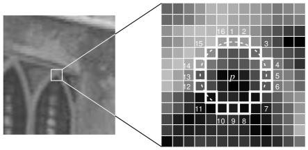

# PTAM
## PTAM的创新性
1. 提出并实现了**跟踪**与**建图**过程的**并行化**，跟踪部分需要实时响应图像数据，而对地图的优化则没必要实时地计算。后端优化可以在后台慢慢进行，然后在必要的时候进行线程同步即可。 这是视觉SLAM中首次区分出前后端的概念，引领了后来许多视觉SLAM系统的设计（我们现在看到的SLAM多半都分前后端）。
2. 第一个使用 **非线性优化**，而不是使用传统的滤波器作为后端的方案。
3. 引入了关键帧机制不必精细地处理每一幅图像，而是把几个关键图像串起来，然后优化其轨迹和地图。早期的SLAM大多数使用EKF滤波器或其变种，以及粒子滤波器等；在PTAM之后，视觉SLAM研究逐渐转向了以非线性优化为主导的后端。由于之前人们未认识到**后端优化的稀疏性**，所以觉得优化后端无法实时处理那样大规模的数据，而PTAM则是一个显著的反例。

具体而言
**姿态跟踪线程** 不修改地图，只是利用已知地图来快速跟踪；
**地图线程** 专注于地图的建立、维护和更新。
优点 ： 即使建立地图线程耗时稍长，姿态跟踪线程仍然有地图可以跟踪（如果设备还在已建成的地图范围内）.
缺点： 如果地图建立或优化过慢，跟踪线程很容易会因为没有最新的地图或者没有优化过的地图而跟丢。
## 基于多线程的tracking和mapping策略

### tracking
#### - 构造图像金字塔
  金字塔分层以加快匹配同时提高地图点相对于相机远近变化时的鲁棒性
####  FAST特征提取

是一种角点检测算法，其主要优点是计算速度较快

其计算逻辑如下
1. 选择点p
2. 选择灰度阈值t与像素个数阈值n
3. 选择围绕p点的16个像素所构成的圈（半径为3的布雷森汉姆圈）
4. 如果这16个像素中有n个点的灰度值比p点大t或小t，那么这个点就是角点 \

其中有一些优化速度的步骤，先选择16个像素的1、5、9、13为比对点，若$n2$个像素比对阈值大于t则认为p点不是角点，否则则全部比对。
朴素的算法有一些缺点，其一是n=12（作者原方法参数）时，得到的p点非常多
#### 地图初始化
- 跟踪定位
- 选取添加关键帧到缓存队列
- 重定位
### mapping
- 局部BundleAdjustment
- 全局BundleAdjustment
- 从缓存队列取出关键帧到地图
- 极线搜索加点到地图

## 与一般SLAM框架共有的环节
- 传感器数据获取（摄像头输入图像数据）
- 前端视觉里程计（跟踪定位、重定位）
- 后端优化（Bundle Adjustment）
- 建图（极线搜索加点）
- 没有回环检测

# 
- 关键帧的发展道路
- Mapping仅处理关键帧
- 局部光束法平差（Boundle Adjustment）来优化路标点与相机位姿
- 
