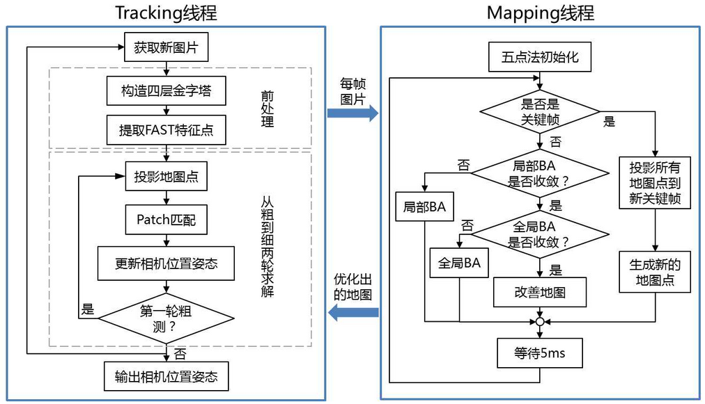

# PTAM
## 基于多线程的tracking和mapping策略

提出并实现了**跟踪**与**建图**过程的**并行化**，跟踪部分需要实时响应图像数据，而对地图的优化则没必要实时地计算。后端优化可以在后台慢慢进行，然后在必要的时候进行线程同步即可。 这是视觉SLAM中首次区分出前后端的概念，引领了后来许多视觉SLAM系统的设计（我们现在看到的SLAM多半都分前后端）。

### tracking
- FAST特征提取
- 地图初始化
- 跟踪定位
- 选取添加关键帧到缓存队列
- 重定位
### mapping
- 局部BundleAdjustment
- 全局BundleAdjustment
- 从缓存队列取出关键帧到地图
- 极线搜索加点到地图

## 与一般SLAM框架共有的环节
- 传感器数据获取（摄像头输入图像数据）
- 前端视觉里程计（跟踪定位、重定位）
- 后端优化（Bundle Adjustment）
- 建图（极线搜索加点）
- 没有回环检测

# 
- 关键帧的发展道路
- Mapping仅处理关键帧
- 局部光束法平差（Boundle Adjustment）来优化路标点与相机位姿
- 
