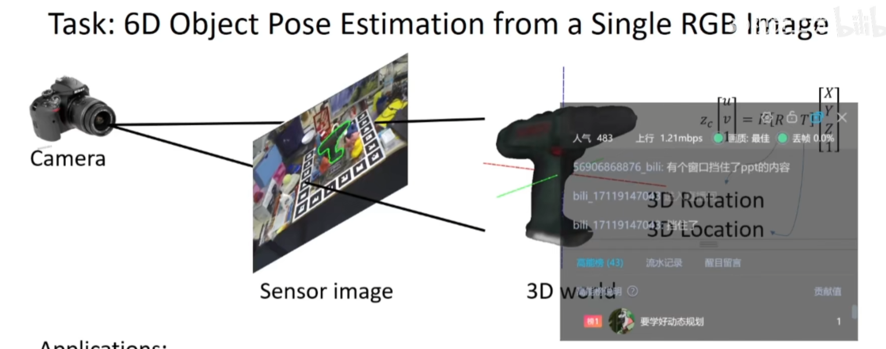
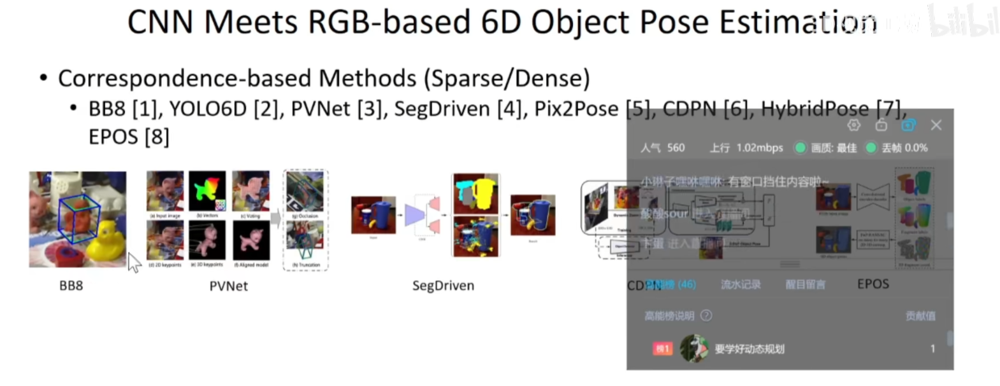
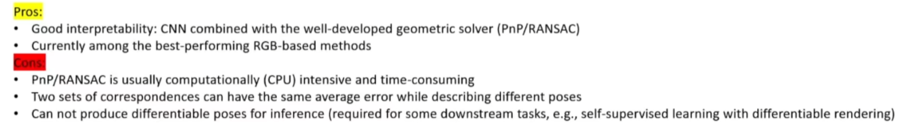
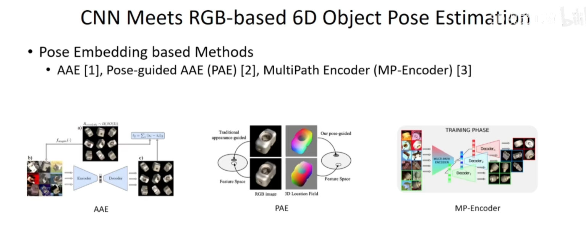

## sparse：
预测box八个顶点，通过求解pnp求解姿态

## Dense
三维模型表面三维坐标已知
从图像直接预测密集三维坐标
更加鲁棒

### Pros
- 可解释性好
- 当前的baseline

### cons

## AAE
将R离散化为sa3空间离散点
渲染图片加噪声
重建不带噪声图片
隐变量 马本 匹配

## PAE
AAE + 重建3d

## MP-Encoder
共享部分encoder
不同物品不同decoder

