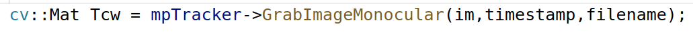
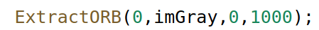
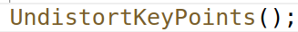
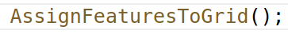
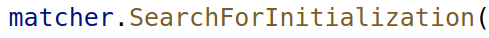
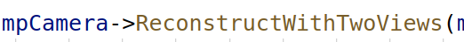
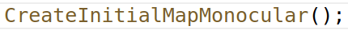

# 单目初始化
- 入口

- 未初始化则初始化
	- 初始化帧
	- 跟踪入口
	
		- 提取特征
			
		- 去畸变
			
		- 分配特征加速计算
		  
	- 单目初始化
	  
	- 初始化器，设置参考帧
	 
	- 构建orb特征旋转直方图
	  
	 - 初始化相机位姿与图像特征三维点
	  
	- 地图初始化
	  
	  
	  
# 初始化之后进行跟踪
- 

