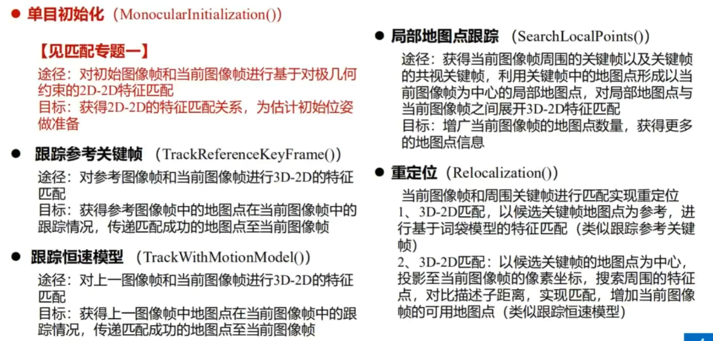
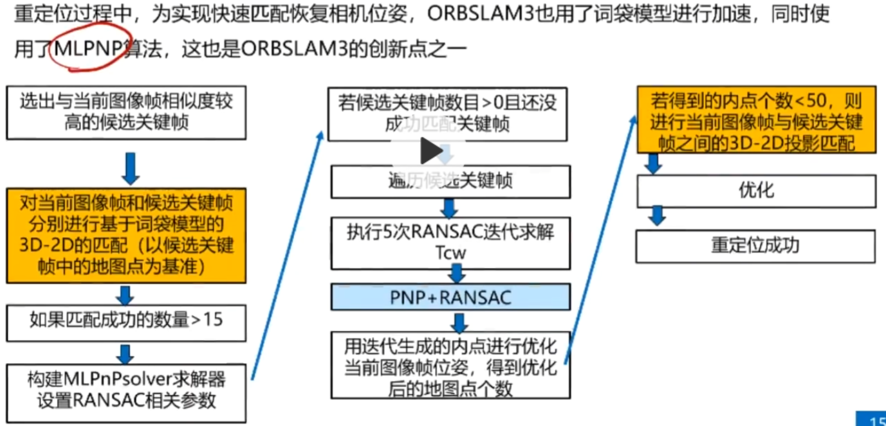
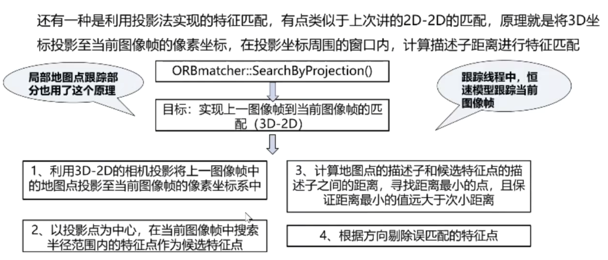
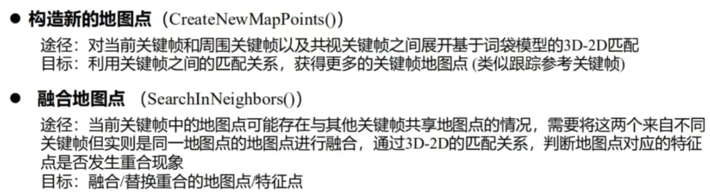
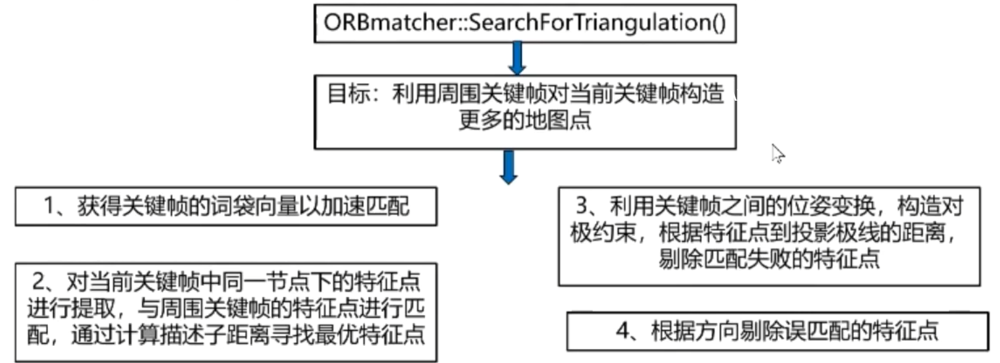
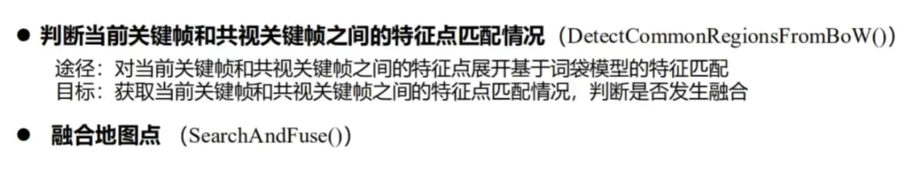
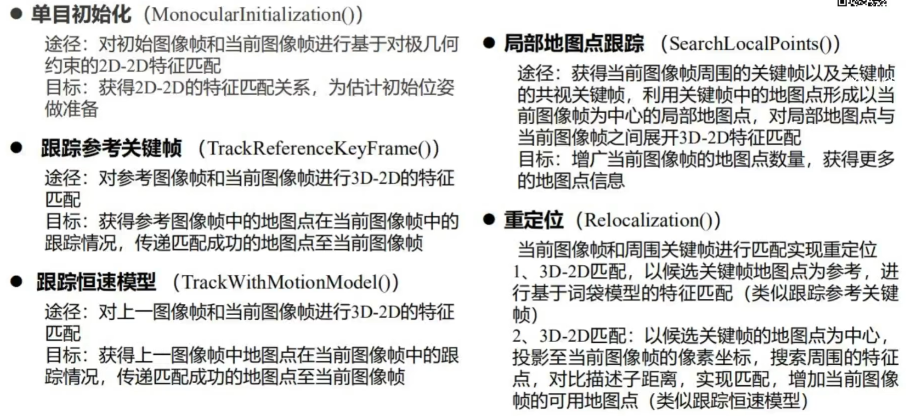

ORBSLAM3

# 线程分解

- TRACKING
- LOCAL MAPPING
- LOOP & MAP MERGE & FULL BA

  
  
### 信号同步:初步对齐
上一帧图像的时间戳 < IMU测量量的时间戳 <= 当前图像时间戳  $\to$ 存入IMU测量vector
  
### Tracking线程
预积分 初始化 第一次（构造） 第二次（匹配） 跟踪 跟踪恒速模型 跟踪参考关键帧 局部地图跟踪 轨迹记录
 
- 初始化阶段：
loop1. 进行一次IMU预积分 存入第一个图像帧 未初始化状态，查看帧状态
构建初始化估计器  
帧状态：特征点数目是否大于100

loop2. 进行一次IMU预积分 存入第二个图像帧
特征点数目是否大于100且两帧图像时差小于1s

进行三角化求解相机位姿与空间3d点位置，
三角化：同时求解H矩阵和F矩阵并且打分，哪个更好用哪个
 
 三角化成功：
 1. 创建初始地图点
 2. 进行一次全局BA
 3. 求解初始关键帧的中值场景深度？
 4. 尺度初始化与归一化平面？
  逆深度
 
 
- 初始化结束
1. 跟踪恒速模型
   
**视觉和IMU如何粗对齐？**

### LOCAL MAPPING 线程
1. 处理关键帧，根据关键帧构造、扩充、融合地图点
2. IMU初始化成功&无待处理关键帧 惯性-视觉BA优化
3. 初始化IMU

- 处理列表中的关键帧
- 处理地图点
- 通过三角化恢复新的地图点  
- 处理完列表，列表为空  ： 融合当前关键帧与相邻关键帧重复地图点
- 删除冗余关键帧
- 初始化IMU
- 局部惯性-视觉BA

### LOOP CLOSING 线程

1. 对比当前关键帧和关键帧数据库，判断回环检测、地图融合

# 匹配算法

 本质矩阵：
 $$
 E = t^{\hat{} }R
 $$
 基本矩阵：
 $$
 F = K^{-T}EK^{-1}
 $$
 单应矩阵：
 $$H=K(R-\frac{tn^T}{d})K^{-1}$$
 对极约束
 $$p_2^TFp_1=0$$
 直接法：不进行匹配，根据当前相机位姿估计值寻找p2的位置
 
 ### ==初始化时刻 #EE3F4D==2D-2D特征匹配及其位姿估计
 - 区域匹配法
在每个初始图像帧特征点邻域内寻找当前图像帧中特征点作为候选点
候选关键点：匹配描述子距离选择具体匹配点输电输电
存在误匹配：RANSAC
同时计算单应矩阵和基础矩阵：打分看谁更高，谁更高用谁 
打分：使用两点投影距离误差计算，score+=th-误差
H矩阵：两点投影距离
F矩阵：对极约束 $th - ||x^{'}Fx||^2/\sigma^2$
恢复R、T：3d点应在相机前方
 
初始化：只是有初值，不一定准
   
   
 
 ### TRACKING 中的匹配
 - 初始化中的匹配
1. 2d-2d匹配
2. 对极约束求解F矩阵、单应求解H矩阵
3. 恢复相机位姿、三角化

 - 重定位中的匹配

当跟踪丢失时，SLAM系统会触发重定位算法，主要是利用当前图像帧与存储在关键帧库中共的关键帧进行3D-2D匹配，然后使用匹配成功的3D-2D点对，估计当前图像帧和匹配的关键帧之间的相对位姿
   
 
 重定位：MLPNP
 - 跟踪参考关键帧
   词袋模型匹配
 - 恒速跟踪模型匹配
 将3D坐标投影到当前图像帧像素坐标，在投影周围窗口检测特征点，并计算描述子距离进行特征匹配
 
 
- 使用局部地图进行跟踪
	当前基于关键帧的跟踪模型匹配不到足够的映射，采用跟踪局部地图点，找当前图像帧的前后关键帧与其共视关键帧中间地图点提出，形成局部地图点，再和当前图像帧进行匹配。
  
-  
 ### LOCAL MAPPING中的匹配
 关键帧是通过跟踪线程确定的，需要实现回环检测以及多次ba优化，需要通过局部地图构建线程，发现更多匹配的地图点
 - 构造新的地图点
 - 融合地图点 

### LOCAL CLOSING 中的匹配

### 匹配方法

- DLT直接线性变换：最主要作用不是用于求解变换，而是实现单目2D到3D的三角化过程

### 特征匹配算法
- 方向一致性检验