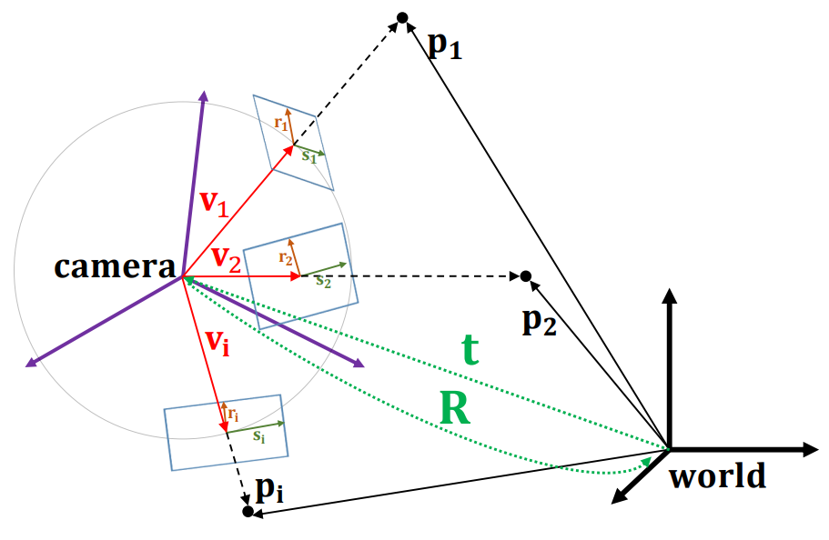
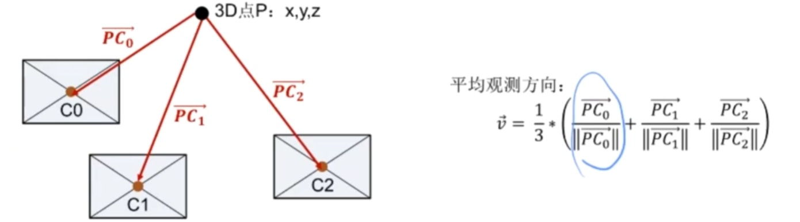

ORBSLAM3

# 线程分解

- TRACKING
- LOCAL MAPPING
- LOOP & MAP MERGE & FULL BA

  
  
### 信号同步:初步对齐
上一帧图像的时间戳 < IMU测量量的时间戳 <= 当前图像时间戳  $\to$ 存入IMU测量vector
  
### Tracking线程
预积分 初始化 第一次（构造） 第二次（匹配） 跟踪 跟踪恒速模型 跟踪参考关键帧 局部地图跟踪 轨迹记录
 
- 初始化阶段：
loop1. 进行一次IMU预积分 存入第一个图像帧 未初始化状态，查看帧状态
构建初始化估计器  
帧状态：特征点数目是否大于100

loop2. 进行一次IMU预积分 存入第二个图像帧
特征点数目是否大于100且两帧图像时差小于1s

进行三角化求解相机位姿与空间3d点位置，
三角化：同时求解H矩阵和F矩阵并且打分，哪个更好用哪个
 
 三角化成功：
 1. 创建初始地图点
 2. 进行一次全局BA
 3. 求解初始关键帧的中值场景深度？
 4. 尺度初始化与归一化平面？
  逆深度
 
 
- 初始化结束
1. 跟踪恒速模型
   
**视觉和IMU如何粗对齐？**

### LOCAL MAPPING 线程
1. 处理关键帧，根据关键帧构造、扩充、融合地图点
2. IMU初始化成功&无待处理关键帧 惯性-视觉BA优化
3. 初始化IMU

- 处理列表中的关键帧
- 处理地图点
- 通过三角化恢复新的地图点  
- 处理完列表，列表为空  ： 融合当前关键帧与相邻关键帧重复地图点
- 删除冗余关键帧
- 初始化IMU
- 局部惯性-视觉BA

### LOOP CLOSING 线程

1. 对比当前关键帧和关键帧数据库，判断回环检测、地图融合

# 匹配算法

 本质矩阵：
 $$
 E = t^{\hat{} }R
 $$
 基本矩阵：
 $$
 F = K^{-T}EK^{-1}
 $$
 单应矩阵：
 $$H=K(R-\frac{tn^T}{d})K^{-1}$$
 对极约束
 $$p_2^TFp_1=0$$
 直接法：不进行匹配，根据当前相机位姿估计值寻找p2的位置
 
 ### ==初始化时刻 #EE3F4D==2D-2D特征匹配及其位姿估计
 - 区域匹配法
在每个初始图像帧特征点邻域内寻找当前图像帧中特征点作为候选点
候选关键点：匹配描述子距离选择具体匹配点输电输电
存在误匹配：RANSAC
同时计算单应矩阵和基础矩阵：打分看谁更高，谁更高用谁 
打分：使用两点投影距离误差计算，score+=th-误差
H矩阵：两点投影距离
F矩阵：对极约束 $th - ||x^{'}Fx||^2/\sigma^2$
恢复R、T：3d点应在相机前方
 
初始化：只是有初值，不一定准
   
   
 
 ### TRACKING 中的匹配
 - 初始化中的匹配
1. 2d-2d匹配
2. 对极约束求解F矩阵、单应求解H矩阵
3. 恢复相机位姿、三角化

 - 重定位中的匹配

当跟踪丢失时，SLAM系统会触发重定位算法，主要是利用当前图像帧与存储在关键帧库中共的关键帧进行3D-2D匹配，然后使用匹配成功的3D-2D点对，估计当前图像帧和匹配的关键帧之间的相对位姿，**PNP算法**
   
 
 
####  EPNP
 构造四个不共面的虚拟控制点，表示世界坐标系下的3D点，若能求出控制点在相机坐标系下的位置，则可以利用控制点作为媒介，得到相机与世界坐标系之间的变换关系$T^w_c$
 已知：
 1. 匹配好的3D点世界坐标 ${}^wP_i$
 2. 匹配好的3D点在相机平面的2D像素坐标$p_i$
求解：
$^c_wT$

对于已知世界坐标点$^wP$来说，取4个控制点$^wC$
$$^wP=\sum_{i=1}^4\alpha_i{}^wC_i$$
已知：
$^cP = T_w^c{}^wP$

$p=K{}^cP$
有
$$p = K{}^cP=K{}T^c_w{}^wP=K{}T^c_w{}\sum_{i=1}^4\alpha_i{}^wC_i=K\sum_{i=1}^4\alpha_i{}T^c_w{}{}^wC_i=K\sum_{i=1}^4\alpha_i{}^cC_i$$
已知$p$,$K$,
有：
$$
s\begin{bmatrix}
u\\v\\1
\end{bmatrix}=
\begin{bmatrix}
f_x & 0 & c_x \\
0 & f_y & c_y \\
0 & 0 & 1 \\
\end{bmatrix}\sum_{i=1}^4\alpha_i
\begin{bmatrix}
{}^cx_i \\
{}^cy_i \\
{}^cz_i \\
\end{bmatrix}
$$

则：
$s=\sum\limits_{i=1}^{4}\alpha_i{}^cz_i$
可以消去s，得到：
$$
\begin{cases}
\sum\limits_{i=1}^{4}\alpha_if_x{}^cx_i+\alpha_i{}^cz_i = 0 \\
\sum\limits_{i=1}^{4}\alpha_if_y{}^cx_i+\alpha_i{}^cz_i = 0 \\
\end{cases}
$$

 一个$P\to p$点的3D-2D点对可以为四个控制点提供两个约束，多个映射构建超定方程求解$^cC$，和$^wC$,在求得$^cP$转换为3D-3D的ICP问题
 $3D\leftrightarrow 3D$问题(ICP求解)，引入重心$^wP_o$和$^cP_o$，构造：
 $$
 A=
 \begin{bmatrix}
{}^wP_1^T - {}^wP_o^T \\
{}^wP_2^T - {}^wP_o^T \\
\vdots
 \end{bmatrix}
 $$
 $$
 B=
 \begin{bmatrix}
{}^cP_1^T - {}^cP_o^T \\
{}^cP_2^T - {}^cP_o^T \\
\vdots
 \end{bmatrix}
 $$
 $$
 H=B^TA
 $$
 最后使用本质矩阵分解得到$R$和$t$
 SVD分解：
 $$
 H=U\Sigma{}V^T
 $$
 $R=UV^T$,$t={}^cP-R{}^wP$

 
 #### MLPNP

上图观测模型的$V$是观测像素的反投影

对于像素坐标来说，映射其到焦点周围半径为1的球面上，对于$V$来说，可得其零特征向量（切平面组成）：
$$V^T\begin{bmatrix}
r & s
\end{bmatrix}=
\begin{bmatrix}
0&0
\end{bmatrix}
$$
则有：
$$\lambda\begin{bmatrix}
r^T\\s^T
\end{bmatrix}
V=\begin{bmatrix}
r^T\\s^T
\end{bmatrix}TP=
\begin{bmatrix}
0 \\ 0
\end{bmatrix}
$$
 构建超定方程求解
 
 若3D点均处于同一平面：
 添加约束项
 $M=[P_1 , P_2,\cdots]$，定义$S=MM^T$，利用S转换所有P至新坐标系，用S的特征向量作为旋转矩阵$R_s$,则使用$P^{'}=R_sP$为计算3D点。求出$R$后用$R=R_sR$得到最终的值
 
 重定位：MLPNP
 - 跟踪参考关键帧
   词袋模型匹配
 - 恒速跟踪模型匹配
 将3D坐标投影到当前图像帧像素坐标，在投影周围窗口检测特征点，并计算描述子距离进行特征匹配
 
 
- 使用局部地图进行跟踪
	当前基于关键帧的跟踪模型匹配不到足够的映射，采用跟踪局部地图点，找当前图像帧的前后关键帧与其共视关键帧中间地图点提出，形成局部地图点，再和当前图像帧进行匹配。
  
-  
 ### LOCAL MAPPING中的匹配
 关键帧是通过跟踪线程确定的，需要实现回环检测以及多次ba优化，需要通过局部地图构建线程，发现更多匹配的地图点
 - 构造新的地图点
 - 融合地图点 

### LOCAL CLOSING 中的匹配

### 匹配方法

- DLT直接线性变换：最主要作用不是用于求解变换，而是实现单目2D到3D的三角化过程

### 特征匹配算法
- 方向一致性检验

# 3D空间点（地图点）
长期保存在系统中用于跟踪和优化
- 观测到此地图点的关键帧数量：是否保留此地图点
- 能被多少帧图像看到 能被多少帧图像看到且匹配
### 通过匹配的两帧图像中的特征点恢复3D空间点坐标
三角化恢复深度
已知像素点和相机相对位姿
两个像素点和相机投影模型构成超定方程-svd分解得出坐标
### 通过三角化生成新的地图点
对当前处理的关键帧提取共视关键帧，对当前关键帧和共视或周围关键帧进行特匹配，不检测特征点，只使用已有特征点进行匹配，构造更多的地图点
LOCAL MAPPING 线程中
在当前关键帧的共视关键帧中提取共视程度最高的几个关键帧
如果是IMU模式，增加更多的关键帧：添加前一关键帧
对比关键帧时：若关键帧距离过近，恢复的3D点不准，跳过此关键帧
**三角化过程**：
1. 反投影得到射线
2. 判断射线之间的夹角判断是否三角化
3. 三角化恢复深度

- 地图点的平均观测方向

- 地图点的单帧观测余弦值：判断地图点是否能被当前图像帧所观测到
  计算当前相机坐标对3D点的观测方向和平均观测方向计算余弦值
  
- 地图点的深度
	地图点在当前图像坐标系下的3D坐标范数
	$$depth= ||[X_c,Y_c,Z_c]||$$
- 短期地图点：存储在帧间的地图点，不存在于局部地图
- 长期地图点：精度较好的地图点

**删除地图点**：
- 图像帧：删除图像帧地图点内容
- 删除地图点在关键帧的观测、删除关键帧中此地图点的特征匹配信息

**删除地图点条件（图像帧）**：
- 图像帧跟踪状态正常，每次跟踪结束会在Tracking线程检查当前图像帧中所有地图点观测情况，若观测小于1，则认为此地图点无效
- 跟踪状态正常，检测是否在BA中被设置为了外点
- 跟踪参考关键帧、跟踪恒速模型优化是否为外点
- 局部地图进行匹配搜索时，是否被设置为外点
- 重定位时此地图点是否为外点

 **关键帧中的不可靠的地图点**
 - 可以跟踪到次地图点的图像帧数量与可以观测带此地图点图像帧数量比小于0.25
 - 若地图点观测数量小于阈值，且跟踪到的关键帧ID距离太远（2）
 - 若关键帧需要被剔除，观测--

#### 地图点的融合
去除冗余地图点，减少内存消耗，提升匹配精度与轨迹估计精度
在LOCALMAPPING线程中，对当前关键帧中所有地图点与所有一级、二级（共视关系）关键帧中地图点进行融合，保留相同地图点，剔除冗余地图点。
- 获取当前关键帧地图点在周围关键帧中的坐标
- 反投影获取像素坐标
- 投影距离&观测方向 判定
- 在周围关键帧像素坐标的一定半径范围内寻找特征点
- 计算寻找到特征点与地图描述子距离，找到最近的特征点
- 在周围关键帧中寻找此最佳特征点对应的地图点
- 若已存在地图点，使用地图点，否则添加地图点

### 如何优化地图点
地图点的优化主要是与位姿优化一起实现的
投影方程：
$$
s_i\begin{bmatrix}
u\\v\\1
\end{bmatrix}=
K\exp(\xi^{\text{^}})\begin{bmatrix}
X\\Y\\Z\\1
\end{bmatrix}
$$
 最小二乘：
 $$
 \xi^{\text{^}},P = \arg\min_{\xi^{\text{^}},P}\frac{1}{2}\sum||p_i-\frac{1}{s_i}K\exp(\xi^{\text{^}})P||
 $$
# 关键帧

关键帧：具有代表性的图像帧
- 节约内存
- 恢复、构建、扩增地图点
- 优化地图点与关键帧相机位姿，约束全局轨迹位姿
### 选取准则
- 分布均匀
- 图像清晰
- 共视程度适当，既有辨识度又有关联性
- 即具有辨识度又具有关联性

### 选取指标
- 与上一关键帧之间间隔的图像帧数足够多
- 与距离最近的关键帧之间相机运动足够大
- 跟踪质量和共视特征点数量 

**准则1**
1. 当前图像帧至少相隔MAX个图像帧
2. 局部建图至少相隔MIN个图像帧，且局部建图线程属于可接受关键帧状态
3. 双目模式下特征匹配成功数据<1/4\*参考关键帧中跟踪成功的数据或需要插入最近地图点

**准则2**：
（跟踪和匹配情况）当前图像帧匹配成功数据< thRefRatio\*参考关键帧中跟踪成功的数目且当前图像帧中匹配成功的数据大于15

# SLAM整体定位精度
1. 地图点位置估计精度：由于图像帧的位姿估计，不是依赖与2D-2D匹配，而是对地图点进行跟踪，即3D-2D匹配，因此3D点位置的精度会严重影响匹配结果，从而影响图像帧的位姿估计结果
2. 关键帧的位姿估计精度：关键帧是被长期存储在系统中的，包括后期的回环检测和重定位等操作都很依赖关键帧的位姿精度，且关键帧是恢复更多3D地图点的关键，与地图点相辅相成，因此对整体轨迹估计的影响很重要。

