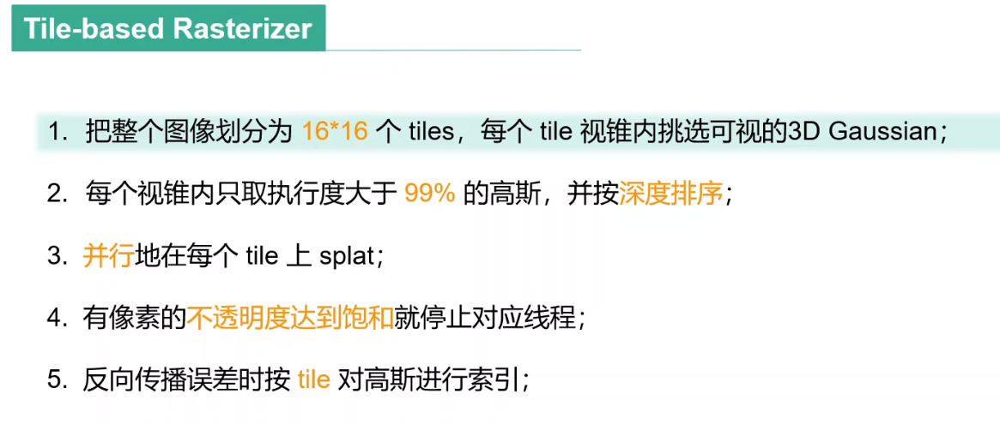
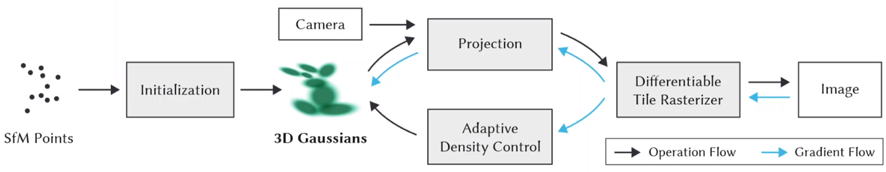

-----
# 3D 高斯

# 具体方法
- 可微的3D gaussian splatting

## 可微的 3D gaussian splatting

### 协方差矩阵的物理含义
$$\Sigma = A^TA$$

$R$为旋转矩阵，控制高斯分布的方向，$S$为比例系数，控制高斯分布椭球的形状。

- 旋转矩阵如何优化？：使用四元数进行求导优化，同时控制协方差矩阵的半正定性质
- 如何对旋转矩阵和尺度求导：论文推导？
- 椭球如何投影成平面的图像：对协方差矩阵做变换？

## 优化以及其自适应密度控制

- Sigmoid激活函数用于将不透明度约束到(0,1)
- Exponential激活函数用于激活尺度

- 判断是否重建充分的依据是梯度
	- 根据方差区分两种情况：
		- 方差大：3DGS很大-分割
		- 方差小：3DGS很小-克隆
	- 克隆：沿梯度方向安置新的点

## 快速可微光栅化

1. 构建SfM点云
2. 已每个点中心生成高斯
3. 用相机参数把点投影到图像平面上 splatting
4. 从splatting做tile-base的光栅化得到渲染图像
5. 将渲染图像和GT图像求loss
6. 自适应的密度控制模块根据传递到点上的梯度来决定是否对3D高斯分割、克隆
7. 梯度传递到3d高斯来更新其中存储的位置、协方差矩阵、球谐函数、不透明度等参数