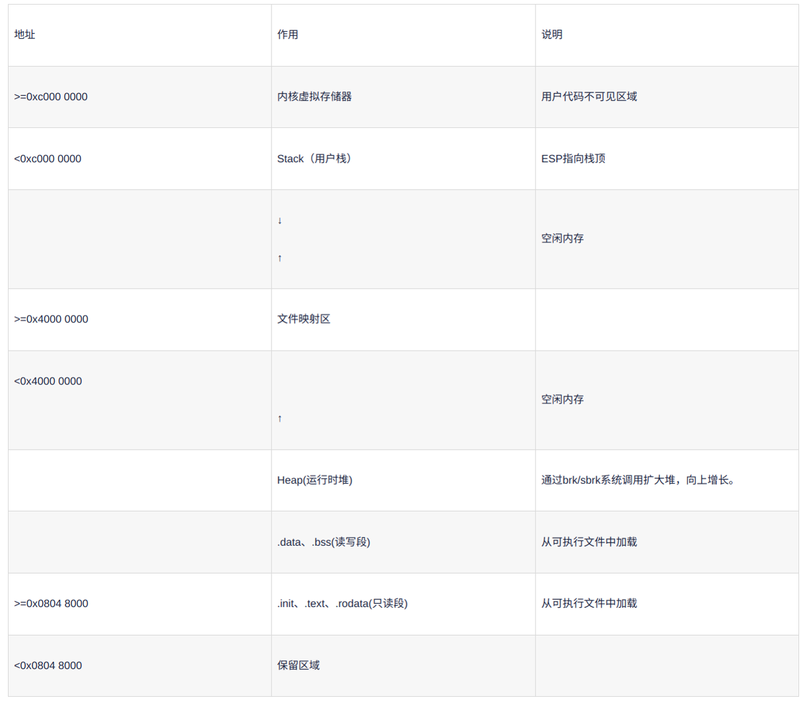

2024-01

## linux内存模型

## malloc、free和new、delete 的区别

- malloc、free是c语言的库函数
- new、delete是c\+\+的操作符

用于分配和释放内存

1. 使用
	- new 自动计算内存分配大小
	- malloc 手动计算内存分配大小
2. 返回值
	- new的返回值是改类型对象的指针
	- malloc返回的是一个 void * 已擦除类型，需要进行类型转换
		`Task *ptack = malloc(sizeof(*ptask))`
3. 分配失败
	- new 分配失败，抛出异常
	- malloc 分配失败，返回 NULL
4. 分配空间
	- new 通常在free store 自由存储区上分配空间
			1. operator new 可重写，如果没有重载，则在堆上进行分配，如果重载，指定分配的方式
			2. 申请足够空间
			3. 调用构造函数，初始化成员变量，已经拥有物理内存
	- malloc 大小小于128k，通过brk进行系统调用进行，若内存值中有，则分配内存值，若内存值不够在堆空间进行内存分配，大于128k通过mmap系统调用在文件映射区进行分配
		1. 无初始化，最开始只有虚拟内存，最后通过缺页中断进行映射到真实物理内存
		2. 在头部多分配sizeof(size_t) 的空间
5. 释放
	- delete 需要对象类型的指针
		1. 调用析构函数
		2. operator delete 可重写
		3. 释放空间
	- free是 void * 类型的指针，不需要具体类型
		1. 释放多大空间根据头部存储信息来判定
		2. 释放内存之后，若是brk或内存值中分配空间，释放到在内存值中，若是mmap分配，则还给系统

## 虚函数表和虚函数指针
用于实现多态
多态：
- 静态多态
	通过函数重载（参数，返回值不同），编译器确定
- 动态多态
	继承时重写基类的虚函数，通过虚函数表指针

虚函数表的创建时机：
1. 何时生成
	编译器编译时刻生成，发现`virtual`关键字时刻修饰的函数
2. 存在哪里，可执行程序（磁盘），运行状态（内存）
3. 

## 磁盘中的可执行程序

- .bss 未初始化或初始化为0的全局、静态变量
- .data 初始化的全局、静态变量
- .rodata 只读数据段、虚函数表（虚函数地址的数组->`.text`）

## 虚拟内存构成
- 内核空间
- 栈区
- 文件映射区
- 堆区
- 数据区（静态存储区）  `.bss` `.data`
- 代码区  `.text` `.rodata` 