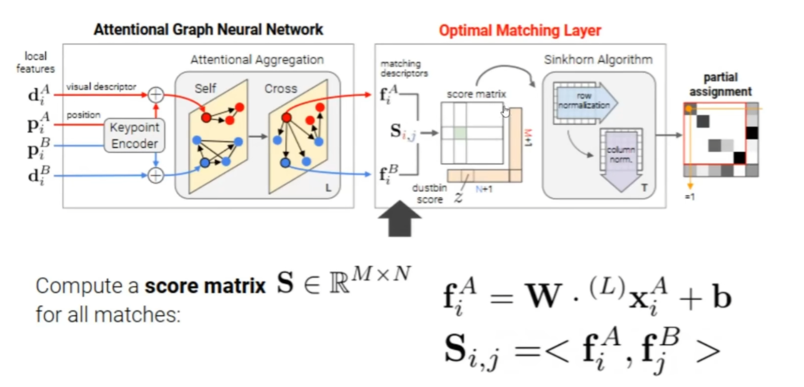

# SUPERPOINT
2024-01-19

 ## 训练集生成：
 **自适应单应变换**
对图像施加不同的单应变换，可以模拟不同的相机视角看到图像

## 基于Encoder-Decoder的网络结构

- input：图像
- Encoder：卷积神经网络
- Decoder：
	- Interest Point： 特征点位置描述，softmax，NMS，reshape
	- Descriptor：描述子生成，插值，L2-Norm

# SURPERGLUE
## 输入：
两组图像的特征点坐标和描述子

## 网络模型

SUPERGLUE主要由基于注意力机制的图网络层和最优匹配层组成。
其中注意力机制网络先对输入描述子和坐标通过一个Encoder聚合，再送到带有注意力机制的网络层进行聚合，最终得到matching descriptors，接着把匹配问题建模成运输问题，利用经典算法sinkhorn求解。

### self-cross注意力机制
借鉴人类在两张图片之间的匹配行为
1. 看本土向内有哪些特征和对应关系
2. 看另外一个图像中是否有相同的地方，有就匹配成功，没有则看另外一个图像中有哪些特征和关系，并且带着这些特征和关系回到本图像上继续看特征或者细节，repeat

抽象为两个行为
1. self-attention：本图像的点，聚合自己图像中其他特征点的信息
2. cross-attention：本图像的点聚合其他图像中特征点的信息

两者交叉进行，信息不断累计，搭配注意力机制，做到了很强的信息聚合能力，最终输出matching descriptor。看作描述子增强

### 运输问题建模求解匹配问题

什么是运输问题：
