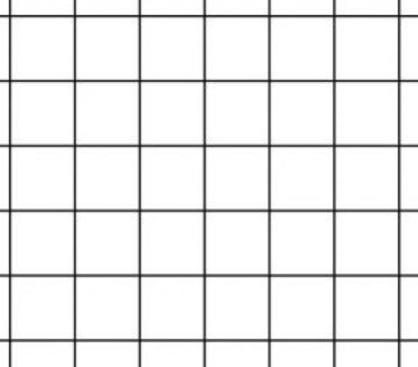

# 构建图像帧
2023-11-06

在构建图像帧时，主要分为以下几个部分
- 提取特征点

## 提取特征点

提取特征点主要分为生成图像金字塔、提取FAST特征点、计算特征点描述子三个部分
### 生成图像金字塔
在计算生成金字塔的时候，只进行调整大小操作，不进行高斯模糊，为了不浪费图像的边界部分，给图像的边界加边，如果让我做的话就不加边，边界部分受畸变影响较大，而且加边之后人为引入了一个偏置，不如减边。
### 提取FAST特征点
在提取FAST特征点的时候，对每一层的金字塔图像，先对图像进行网格划分，再在各个网格内提取FAST特征点，若在网格中未提取到特征点，则降低FAST特征点检测阈值再次检测。

在提取到图像中的FAST特征点之后，按四岔树将特征点分配到各个节点中。
### 计算描述子
