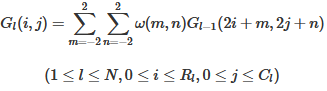
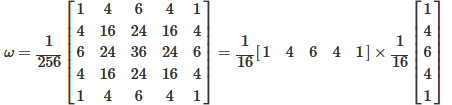
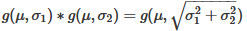
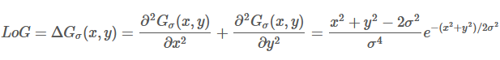
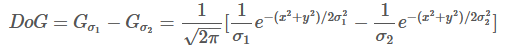
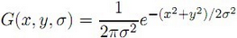

# RANSAC
随机抽样一致性（Random Sample  Consensus）
- 随机从数据集$D$中取最小抽样集$S$，基于$S$估计出模型$M$
- 计算$S$之外数据与$M$的距离，距离小于阈值$t_d$的数据，构成该模型的内点集$I_M$
- 若$I_M$中的个数大于阈值$t_n$，则认为模型$M$为该数据集包含的正确模型
- 重复多次，最终选择包含最多内群点所对应的模型

# 几何特征提取
## 点特征提取与匹配
### SIFT 特征
#### 图像尺度空间理论
https://www.cnblogs.com/ronny/p/3886013.html
计算机没有办法预知图像中的物体尺寸，因此，需要同时考虑图像在多尺度下的描述，获取感兴趣物体的最佳尺度。**图像金字塔**
**金字塔分辨率**
1. 图像经过一个低通滤波器进行平滑（会使得图像变模糊）
2. 对平滑后的图像进行抽样
3. 得到一系列缩小后的图像

高斯核图像金字塔，先对图像进行高斯滤波（模糊），再进行降维

图像金字塔缺乏坚实的理论基础，不能明确分析图像中物体的具体大小

信号的尺度空间刚提出就是通过一系列单参数，宽度递增的高斯滤波器将原始信号滤波得到一组低频信号。基于高斯核的高斯滤波被证明是实现尺度变换的唯一变换核。

虽然很多研究者从可分性、旋转不变性、因果性等特性推出高斯滤波器是建立线性尺度空间的最优滤波器。然后在数字图像处理中，需要对核函数进行采样，离散的高斯函数并不满足连续高斯函数的的一些优良的性质。所以后来出现了一些非线性的滤波器组来建立尺度空间，如B样条核函数。

高斯滤波器对图像进行尺度空间金字塔图的构建具有一些优良性质：
- 加权平均效应
- 有限孔径效应：空间中小于某一尺度的精细结构会被抑制
- 层叠平滑：两个高斯核的卷积等同于另外一个不同参数的高斯核卷积
- 局部极值递性：高斯核对图像进行滤波具有压制局部细节性质
- 尺度伸缩不变性：高斯核滤波后图像的极值点等特征是不变的
  
**尺度的选择**
两幅图像采用相同的固定尺度的LoG（高斯拉普拉斯）检测器检测，LoG检测器相当于一个匹配滤波器，只有当LoG的尺度，与图片目标区域相当时才会产生较强的响应。由于某些图像区域结构是在一定的尺度范围内存在的，所以在尺度空间中进行检测会有重复检测的缺点。
在实际操作中，需要定义一个特征响应函数，在不同的尺度空间上寻找一个极值点（特征响应最强）。
图像结构往往是在粗糙的尺度上被检测到 ，此时位置信息未必是最准确的，通常图像的尺度分析分为两个阶段：首先在粗尺度上进行特征检测，然后再在细尺度上进行精确定位。

**图像特征算子**
**边缘检测：**
一阶导数：一阶导数最大为边缘
二阶导数：二阶导数穿越零点为边缘，基于二阶的方法称为拉普拉斯算法

LoG：先高斯滤波再进行拉普拉斯边缘检测
DoG：两个不同高斯核函数滤波结果的查分。
#### 高斯尺度空间（GSS - Gauss Scale Space）
将图像的尺度空间表示为一个函数$L(x,y,\sigma)$，由一个变尺度的高斯函数与图像$I(x,y)$卷积产生的。即
$$L(x,y,\sigma)=G(x,y,\sigma)*I(x,y)$$

#### 高斯差分（DOG - Difference of Gauss）
##### GSS尺度选择

- 生成高斯差分金字塔（DOG金字塔），尺度空间构建：
- 空间极值点检测（关键点的初步查探）：