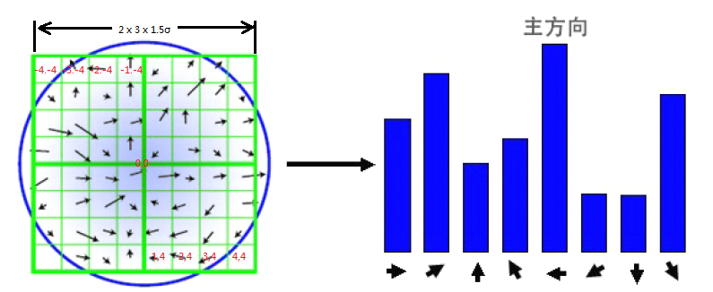
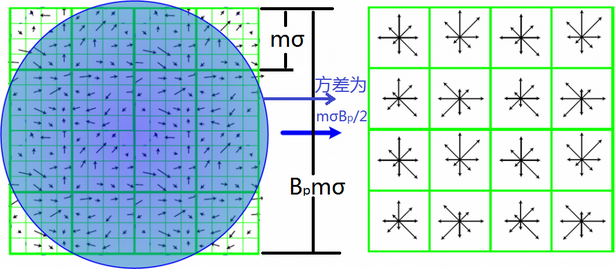

# RANSAC
随机抽样一致性（Random Sample  Consensus）
- 随机从数据集$D$中取最小抽样集$S$，基于$S$估计出模型$M$
- 计算$S$之外数据与$M$的距离，距离小于阈值$t_d$的数据，构成该模型的内点集$I_M$
- 若$I_M$中的个数大于阈值$t_n$，则认为模型$M$为该数据集包含的正确模型
- 重复多次，最终选择包含最多内群点所对应的模型

# 几何特征提取
## 点特征提取与匹配
### SIFT 特征
#### 图像尺度空间理论
https://www.cnblogs.com/ronny/p/3886013.html
计算机没有办法预知图像中的物体尺寸，因此，需要同时考虑图像在多尺度下的描述，获取感兴趣物体的最佳尺度。**图像金字塔**
**金字塔分辨率**
1. 图像经过一个低通滤波器进行平滑（会使得图像变模糊）
2. 对平滑后的图像进行抽样
3. 得到一系列缩小后的图像

高斯核图像金字塔，先对图像进行高斯滤波（模糊），再进行降维

图像金字塔缺乏坚实的理论基础，不能明确分析图像中物体的具体大小

信号的尺度空间刚提出就是通过一系列单参数，宽度递增的高斯滤波器将原始信号滤波得到一组低频信号。基于高斯核的高斯滤波被证明是实现尺度变换的唯一变换核。

虽然很多研究者从可分性、旋转不变性、因果性等特性推出高斯滤波器是建立线性尺度空间的最优滤波器。然后在数字图像处理中，需要对核函数进行采样，离散的高斯函数并不满足连续高斯函数的的一些优良的性质。所以后来出现了一些非线性的滤波器组来建立尺度空间，如B样条核函数。

高斯滤波器对图像进行尺度空间金字塔图的构建具有一些优良性质：
- 加权平均效应
- 有限孔径效应：空间中小于某一尺度的精细结构会被抑制
- 层叠平滑：两个高斯核的卷积等同于另外一个不同参数的高斯核卷积
- 局部极值递性：高斯核对图像进行滤波具有压制局部细节性质
- 尺度伸缩不变性：高斯核滤波后图像的极值点等特征是不变的
  
**尺度的选择**
两幅图像采用相同的固定尺度的LoG（高斯拉普拉斯）检测器检测，LoG检测器相当于一个匹配滤波器，只有当LoG的尺度，与图片目标区域相当时才会产生较强的响应。由于某些图像区域结构是在一定的尺度范围内存在的，所以在尺度空间中进行检测会有重复检测的缺点。
在实际操作中，需要定义一个特征响应函数，在不同的尺度空间上寻找一个极值点（特征响应最强）。
图像结构往往是在粗糙的尺度上被检测到 ，此时位置信息未必是最准确的，通常图像的尺度分析分为两个阶段：首先在粗尺度上进行特征检测，然后再在细尺度上进行精确定位。

**图像特征算子**
**边缘检测：**
一阶导数：一阶导数最大为边缘
二阶导数：二阶导数穿越零点为边缘，基于二阶的方法称为拉普拉斯算法

LoG：先高斯滤波再进行拉普拉斯边缘检测
DoG：两个不同高斯核函数滤波结果的查分。
#### 高斯尺度空间（GSS - Gauss Scale Space）
将图像的尺度空间表示为一个函数$L(x,y,\sigma)$，由一个变尺度的高斯函数与图像$I(x,y)$卷积产生的。即
$$L(x,y,\sigma)=G(x,y,\sigma)*I(x,y)$$

#### 高斯差分（DOG - Difference of Gauss）
SIFT算法建议，在某一尺度上对特征点的检测，可以通过对两个相邻高斯尺度空间的图像相减，得到一个DoG的相应图像$D(x,y,\sigma)$，然后通过非极大值抑制（局部最大搜索，正最大、负最大），在空间位置和尺度空间中定位特征点。其中

式中，k为相邻尺度空间倍数的常数。
优点
- 用$\sigma^2$标准化的高斯拉普拉斯有着真正的尺度无关性
- 。。。有着更稳定的图像特征
- DoG是LoG的近似，常数项(k - 1)并不会影响极值的位置
- DoG计算量更小

##### GSS尺度选择

K值的大小对于稳定性没有影响，k值生成策略为:
尺度空间图像个数：$n=s+3$
$k=2^{\frac{1}{s}}$

当完成一组图像尺度集生成后，$2\sigma$的数据总是导数第三层，使用尺度大小为$2\sigma$的高斯滤波图像作为下一个数据尺度集的父图像

为了使得直接使用跨像素降采用可以在加快计算效率同时不损失尺度连续性，当$s=2$，如下图，不损失尺度连续性，所以使用$n=s+3$

**二维高斯卷积性质**
- 距离高斯核中心3σ距离外的系数很小，相对于3σ内的系数值可以忽略不计，所以只用$(6σ + 1)*(6σ + 1)$的面积计算卷积即可。
- 线性可分$O(n2*M*N) \to (n*M*N) + O(n*M*N)）$
- 对一幅图像进行多次连续高斯模糊的效果与一次更大的高斯模糊可以产生同样的效果

- 生成高斯差分金字塔（DOG金字塔），尺度空间构建：
- 空间极值点检测（关键点的初步查探）：

#### Keypoint Localization

##### 关键点找寻
在DoG空间中找寻局部最大点，与前一层、后一层进行比对

##### 关键点定位
离散点的位置并非是真正位置。

使用插值的方法进行求取极值点

第一步是寻得关键点的粗略位置（基于像素），第二步是改善定位精度（亚像素）并去除不良特征。拟合到局部区域以插入最大值或者最小值进行。3D二次曲面
亚像素定位通过拟合一个泰勒展开去拟合一个3D二次曲面（$x,y,\sigma$）,然后通过局部区域插值来精确定位区域极值。忽略泰勒展开的二次以上的项。

当z的导数为零时，便得到了z的精确坐标，在具体的估计近似过程中，使用标准差分近似法进行从DoG空间中的相邻样本点估计参数，得到一个3x3的线性系统，进行迭代估计，任何计算出的偏移值超过半个像素的分子行为将导致重新估计$\hat{z}$，因为近似值的适当领域将产生变化。不能快速收敛的点被视为不稳定的点而丢弃。计算公式如下：

对局部点进行插值

最终极值点为：$x=x+\hat{x}$

多次迭代提高精度，一般为五次迭代

**关键点优化**
对关键点定位后，需要删除差的关键点
指标
- DoG相应较低，低于某一阈值
- 落在图像边缘的点

落在图像边缘的点

大于的点被拒绝

##### 确定特征点的方向
**计算领域梯度与幅值**
为实现图像旋转不变性，需要根据检测到的特征点的局部图像结构求得一个方向基准。使用图像梯度的方式求取该局部结构的稳定方向。对于已经检测到的特征点，我们已经知道该特征点的尺度$\sigma$，根据这一尺度在高斯尺度空间中取得最接近这一尺度的高斯图像，之后使用有限差分，计算以此特征点为中心，以$3\times{}1.5\sigma$为半径的区域内图像梯度的幅角与幅值。

**计算梯度方向直方图**
在完成特征点领域的高斯图像的梯度计算后，使用直方图统计领域内像素的梯度方向与幅值。梯度方向直方图的横轴是梯度方向，纵轴是梯度方向角对应的梯度幅值（带有高斯权重）累加值。梯度方向直方图将0-360°的范围分为36个柱，每10°一个柱，直方图的峰值代表该特征点处领域内图像梯度的主方向，也是该特征点的主方向。

绿色格点代表领域范围，蓝色圆圈代表格点的高斯权重，黑色箭头指向代表梯度方向
- 生成领域各像元的高斯权重，其中高斯函数方差为该特征点的尺度特征$\sigma$的1.5倍，形式如下，其中(i,j)为该点距离特征点的相对位置。
 
 - 遍历领域（绿色）中每个点，判断其梯度方向，将其加入相应的梯度方向直方图中，加入量为其梯度幅值、\*wij。直至遍历整个邻域，统计出该特征点处的梯度方向直方图
 - 平滑直方图，得到最终的梯度方向直方图

**高斯权重**
由于SIFT算法只考虑了尺度与旋转的不变性，没有考虑仿射变换不变性，通过高斯权重使得特征点附近的梯度幅值有较大的权重，部分弥补没有仿射变换不变性带来的特征点不稳定问题。

**确定特征点方向**
直方图中最大的值为该特征点主方向，大于最大值80%的值认为是该特征点辅方向，以增强匹配的鲁棒性。具体而言，就是将该特征点复制成多份特征点。除了方向不同，x，,y,sigma都相同
【Note】在OpenCV中，若辅方向除了满足大于最大值80％外，还必须是局部最大值，即 hist[i] > hist[i-1] && hist[i] > hist[i+1]。
通常离散的梯度方向直方图，可以通过插值拟合处理，这样可以得到更精确的方向角度值。

##### 特征描述子
**确定描述子采样区域**
SIFT描述子h(x,y,theta)，是一个三维的阵列，通常表示为矢量。
特征描述子与特征点所在的尺度有关，因此，对梯度的求取应在特征点对应的高斯图像上进行。将特征点附近领域划分为BpxBp个子区域,每个子区域$m\sigma$个像素点，其中m=3,Bp=4，sigma为特征点的尺度值。考虑到实际计算时采用双线性插值，计算的图像区域为msigma(Bp+1)。再考虑旋转，实际图像区域大小为$m\sigma{}(B_p+1)\sqrt{2}$

**生成描述子**
为保证特征矢量旋转不变性，需要以特征点为中心，将特征点附近邻域内图像梯度位置与方向旋转一个方向角$\theta$，即将原图像x轴旋转到与主方向相同的方向。

在特征点附近旋转后，以特征点为中心，在旋转后的图像取$m\sigma{}B_p\times{}m\sigma{}B_p$图像区域，将其等间隔划分，每个间隔m\sigma像素点

**生成特征向量**
在每个子区域内计算8个方向的梯度方向直方图，绘制每个梯度方向的累加值，形成一个种子点。与求取特征点主方向有所不同，此时每个子区域的梯度方向直方图将0-360°划分为8个45°方向范围，每个种子点共有8个方向的梯度强度信息，由于存在16个子区域，所以有16x8=128维度的SIFT特征矢量。同样将特征矢量进行高斯加权处理，加权采用方差为$m\sigma{}B_p/2$的标准高斯，其中距离为各点相对于特征点的距离。使用高斯加权是为了防止微小的位置变化给特征向量带来很大的改变，并且给远离特征值的点赋予较小的权重，防止误匹配。

在相邻的8维SIFT特征中，为了防止人为引入的单元导致的边界效应，使用三线插值的方式使得特征平滑，具体操作可以看作将8维特征加权分配相邻的单元。

为了去除光照变化的影响，需对上述生成的特征向量进行归一化处理，在归一化处理后，对特征矢量大于0.2的要进行截断处理，即大于0.2的值只取0.2，然后重新进行一次归一化处理，其目的是为了提高鉴别性。