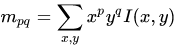
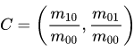
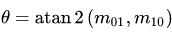

# 人工特征点
人工设计的特征点一般都具有以下性质:
- 可重复性：相同的区域可以在不同的图像中找到
- 可区别性：不同的区域有不同的表达
- 稀疏性：特征点的数量远小于像素的数量
- 局部性：特征点仅与一小片区域相关

**特征点**由**关键点**与**描述子**两部分组成
关键点通常值该特征点在图像中的中心定位，有的特征点还有朝向、大小等信息。描述子通常是一个向量，按照人为设计的方式描述该周围像素的信息。描述子的设计原则是外观相似的特征应该具有相似的描述子。

# ORB特征
**Oriented FAST and Rotated BRIEF**
特征点使用： Oriented FAST
描述子：Rotated BRIEF

ORB将这两种方法进行来改进并结合在了一起，得到了一种可以快速提取的ORB特征，在速度方面相较于SIFT与SURF有明显的提升同时保证了特征子的旋转、尺度不变性。

# Oriented FAST
FAST无法体现出一个优良特征点的尺度不变性与特征不变性
尺度不变性：使用金字塔来解决
方向不变性：质心标定方向来解决

## 尺度不变性
1. 对图像做不同尺度的高斯模糊
2. 降采样
3. FAST特征点检测
4. 在图像尺度空间中所有的特征点作为图像的FAST特征点

## 旋转不变性
1. 在局部图像中定义图像块的矩
   
2. 通过矩找到图象块的质心
   
3. 连接特征点与质心得到方向向量，为特征点方向
   
   
   
# Rotated BRIEF
## BRIEF
