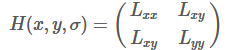
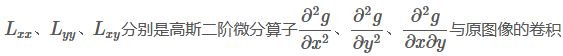
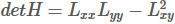
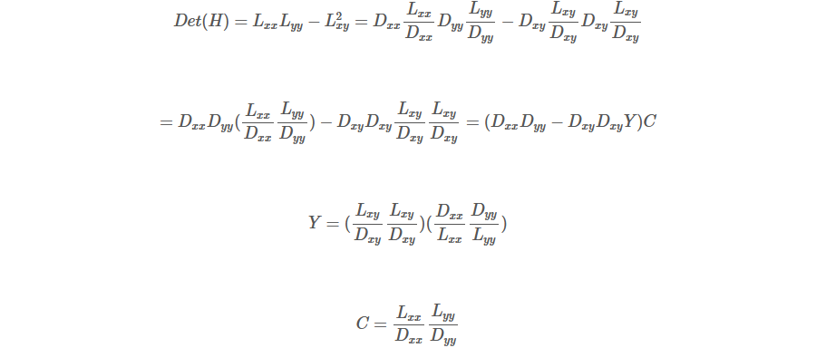
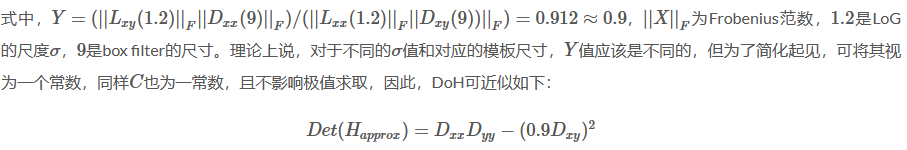
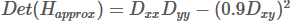
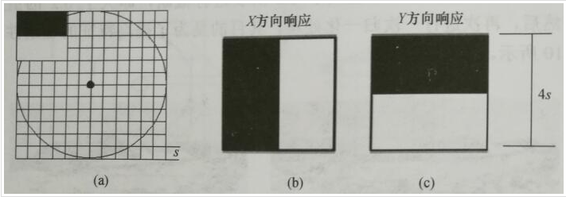
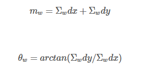
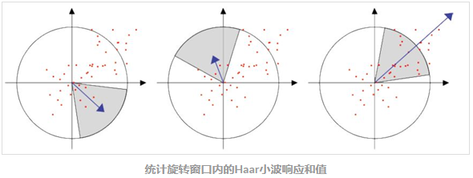

加速鲁棒特征(Speed Up Robust Feature, SURF)和SIFT特征类似，同样是一个用于检测、描述、匹配图像局部特征点的特征描述子。

# 积分图
积分图是一种用于快速计算矩阵图像区域像素之和的数据结构，积分图中(x,y)处的值是原始灰度图像左上角与当前点所围成的矩形区域内所有像素点灰度值之和。

借助积分图，图像与高斯二阶微分模板的滤波转化为对积分图像的加减运算，从而在特征点的检测时大大缩短了搜索时间。

求取积分图时，对图像所有像素遍历一遍，得到积分图后，计算任何矩形区域内的像素灰度和只需进行三次加减运算，如下图所示。

# 近似DoH金字塔

**Hessian矩阵近似**

Hessian矩阵可用于图像的斑点检测，使用Hessian矩阵的行列式DoH作为构建图像尺度空间的方式，反映了图像的局部纹理、结构信息

步骤
1. 使用不同的σ生成(∂2g∂x2+∂2g∂y2)或∂2g∂x2、∂2g∂y2、∂2g∂x∂y高斯卷积模板，并对图像进行卷积运算。
2. 在图像的位置空间和尺度空间搜索LoG或DoH的峰值，并进行非极大值抑制，精确定位到图像极值点。

简化Hessian矩阵行列式：

在实际计算滤波响应值的时候，需要使用模版中盒子（矩形）区域的面积进行归一化处理，以保证一个统一的F范数能适应所有的滤波尺寸。

使用近似的Hessian矩阵行列式来表示一个图像中某一点的斑点响应值，遍历图像中的所有像素，便形成在某一尺度下斑点检测的响应图像。使用不同的模糊尺度和模版尺寸，形成多尺度斑点响应的金字塔图像，利用金字塔图像，进行斑点响应极值点的搜索定位。

# 尺度空间表示
借助盒子滤波与积分图像，不断增大盒子滤波模版，通过积分图快速计算盒子滤波响应图像。之后在响应图像中采用非极大值抑制，检测不同尺度的特征点。

# 关键点定位
将响应图像中像素点与领域像素比较，若为极值点，则是该区域的局部特征点。与DoG不同的是，不需要剔除边缘导致的极值点，因为Hessian矩阵的行列式已经考虑到了边缘的问题。

# 特征点方向匹配
为保证特征描述子具有旋转不变性，需要对每个特征点分配一个主方向。为此，以特征点为中心，以6s（s为特征点尺度）为半径的区域内，计算图像的haar小波响应，实际上是对图像进行梯度计算，利用积分图加速

使用$\sigma=2s$的高斯函数对Haar小波的响应值进行加权，为了求取主方向，设计一个张角为$\frac{\pi}{3}$的扇形窗口并进行累加得到矢量$(m_{w},\theta_{\omega})$

主方向为最大Haar响应累加值所对应的方向，即$\theta=\theta_w|maxm_w$

同样，具有主方向与辅助方向