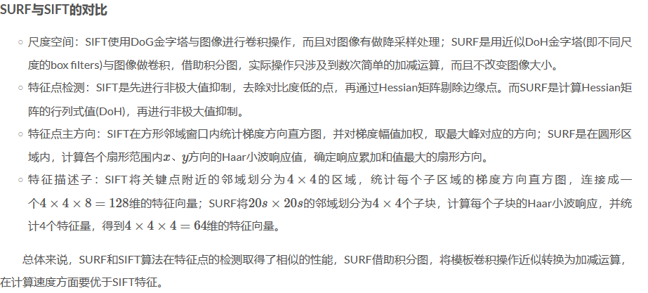
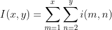
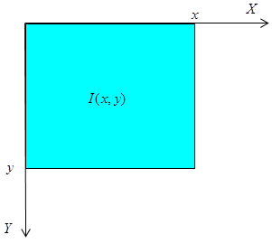
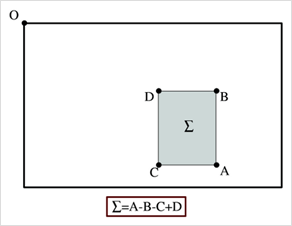

加速鲁棒特征(Speed Up Robust Feature, SURF)和SIFT特征类似，同样是一个用于检测、描述、匹配图像局部特征点的特征描述子。

# 积分图
积分图是一种用于快速计算矩阵图像区域像素之和的数据结构，积分图中(x,y)处的值是原始灰度图像左上角与当前点所围成的矩形区域内所有像素点灰度值之和。

借助积分图，图像与高斯二阶微分模板的滤波转化为对积分图像的加减运算，从而在特征点的检测时大大缩短了搜索时间。

求取积分图时，对图像所有像素遍历一遍，得到积分图后，计算任何矩形区域内的像素灰度和只需进行三次加减运算，如下图所示。

# 近似DoH金字塔
