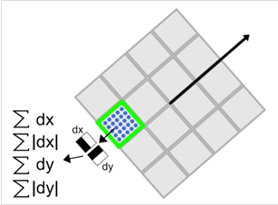
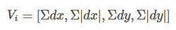
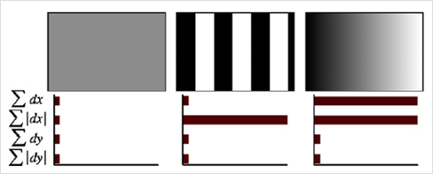

加速鲁棒特征(Speed Up Robust Feature, SURF)和SIFT特征类似，同样是一个用于检测、描述、匹配图像局部特征点的特征描述子。

# 积分图
积分图是一种用于快速计算矩阵图像区域像素之和的数据结构，积分图中(x,y)处的值是原始灰度图像左上角与当前点所围成的矩形区域内所有像素点灰度值之和。

借助积分图，图像与高斯二阶微分模板的滤波转化为对积分图像的加减运算，从而在特征点的检测时大大缩短了搜索时间。

求取积分图时，对图像所有像素遍历一遍，得到积分图后，计算任何矩形区域内的像素灰度和只需进行三次加减运算，如下图所示。

# 近似DoH金字塔

**Hessian矩阵近似**

Hessian矩阵可用于图像的斑点检测，使用Hessian矩阵的行列式DoH作为构建图像尺度空间的方式，反映了图像的局部纹理、结构信息

步骤
1. 使用不同的σ生成(∂2g∂x2+∂2g∂y2)或∂2g∂x2、∂2g∂y2、∂2g∂x∂y高斯卷积模板，并对图像进行卷积运算。
2. 在图像的位置空间和尺度空间搜索LoG或DoH的峰值，并进行非极大值抑制，精确定位到图像极值点。

简化Hessian矩阵行列式：

在实际计算滤波响应值的时候，需要使用模版中盒子（矩形）区域的面积进行归一化处理，以保证一个统一的F范数能适应所有的滤波尺寸。

使用近似的Hessian矩阵行列式来表示一个图像中某一点的斑点响应值，遍历图像中的所有像素，便形成在某一尺度下斑点检测的响应图像。使用不同的模糊尺度和模版尺寸，形成多尺度斑点响应的金字塔图像，利用金字塔图像，进行斑点响应极值点的搜索定位。

# 尺度空间表示
借助盒子滤波与积分图像，不断增大盒子滤波模版，通过积分图快速计算盒子滤波响应图像。之后在响应图像中采用非极大值抑制，检测不同尺度的特征点。

# 关键点定位
将响应图像中像素点与领域像素比较，若为极值点，则是该区域的局部特征点。与DoG不同的是，不需要剔除边缘导致的极值点，因为Hessian矩阵的行列式已经考虑到了边缘的问题。

# 特征点方向匹配
为保证特征描述子具有旋转不变性，需要对每个特征点分配一个主方向。为此，以特征点为中心，以6s（s为特征点尺度）为半径的区域内，计算图像的haar小波响应，实际上是对图像进行梯度计算，利用积分图加速

使用$\sigma=2s$的高斯函数对Haar小波的响应值进行加权，为了求取主方向，设计一个张角为$\frac{\pi}{3}$的扇形窗口并进行累加得到矢量$(m_{w},\theta_{\omega})$

主方向为最大Haar响应累加值所对应的方向，即$\theta=\theta_w|maxm_w$

同样，具有主方向与辅助方向

# 特征描述子生成
同样计算图像的Haar小波响应，与确定主方向不同的是，不再使用圆形区域，而是在一个矩形区域计算Haar小波响应。以特征点为重心，沿主方向将20sX20s的领域划分为4X4的子块，每个子块利用尺寸为2s的Haar模版计算响应值，然后对响应值统计$\sum{}dx$$\sum{}|dx|$$\sum{}dy$$\sum{}|dy|$形成特征向量

将20s的窗口划分为4x4的子窗口，每个子窗口大小为5sx5s，使用尺寸为2s的Haar小波计算子窗口的响应值，然后以特征点为中心，用$\sigma=10s/3=3.3s$的高斯核函数对dx,dy加权计算，最后对每个子块的加权响应进行统计，得到每个子块的向量：

特征维度为4x4x4为64维，SURF特征描述子不仅具有尺度、旋转不变性，还具有光照不变性，由小波响应本身决定 ，对比度不变性通过特征向量的归一化来实现。引入绝对值加和的必要性可由下图表示：

为了充分利用积分图像计算Haar小波的响应值，在具体实现中，不是通过旋转Haar小波模版求其响应值，而是在积分图像上先使用水平、垂直Haar模版求得响应值dx、dy，对dx、dy进行高斯加权处理，并根据主方向的角度对dx，dy旋转变换得到最后的值。

SURF在求取描述子特征向量时，对一个子块的梯度信息进行求和，而SIFT依靠单个像素计算梯度的方向。在有噪声的干扰下，SURF算法具有更好的鲁棒性。一般而言，特征向量的长度越长，特征描述子的独特性就越好，但是匹配时代价就越大。对于SURF描述子，可以将其扩展到128维度，具体方法就是区分dx<>0的情况，为了实现快速匹配，SURF在特征向量中添加一个新匀速，即特征点的拉普拉斯响应正负号。在检测特征点时，将Hessian矩阵的trace正负号记录下来，作为特征向量中的一个变量。在特征匹配时可以节省运算时间，因为只具有相同正负号的特征点才可能匹配，对于不同正负号特征点不再进行相似性计算
