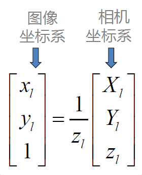
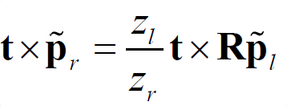

当相机为单目时，我们只知道2D的像素坐标，因而问题是根据两组2D点估计运动，该问题用对极几何来解决。
# 对极约束

**本质矩阵E**：反映【空间一点P的像点】在【不同视角摄像机】下【摄像机坐标系】中的表示之间的关系。
前面我们已经知道了各个坐标系之间的转换
- 相机坐标系与世界坐标系

- 相机坐标系与图像坐标系
 
 - 两相机坐标系某点与对应图像坐标系的关系：

- 同一点在两相机坐标系之间的关系

- 两边同时叉积t：

- 再点积pr

**本质矩阵求解**
- 基本方程

- 线性方程求解

有九个点（非共面）时，可求得线性解

解与真实解相差一个比例系数

- 使用SVD分解求解平移和旋转矩阵

可以证明 本质矩阵有两个相同的非零特征值

**其他**
基本矩阵（Fundamental matrix）：反映【空间一点P的像素点】在【不同视角摄像机】下【图像坐标系】中的表示之间的关系。

两个对应点在像素坐标系的对应关系（含相机内参信息）

**总结**
- 极线是极平面与像平面交线，极点是极线与基线交点
- 本质矩阵确定了两帧图像中对应点的约束关系
- 可以通过8个对应点求解本质矩阵，进一步分解得到R和t

这两个式子都称为对极约束，其几何意义是O1 P O2三者共面。对极约束同时包含了平移与旋转，把中间部分记为两个矩阵：基础矩阵（Fundamental Matrix）F与本质矩阵（Essential Matrix）E，可以进一步简化对极约束：

对极约束简洁的给出了两个匹配点的空间位置关系。于是，相机位姿估计问题编程以下两步：
1. 根据配对点的像素位置，求出E或者F
2. 根据E或者F，求出R，t

由于E、F只相差了相机内参，而内参已知，所以在实践中往往使用形式更简单的E

# 本质矩阵
根据定义，本质矩阵是一个3x3的矩阵，有9个未知数。其性质
- 本质矩阵是由对极约束定义的等式为0的约束，成任意常数后对极约束依然满足，**本质矩阵不同尺度等价**
- 根据，本质矩阵的奇异值必定是的形式，称为本质矩阵的内在性质。奇异值是矩阵里的概念，一般通过奇异值分解定理求得。设A为m*n阶矩阵，q=min(m,n)，A*A的q个非负特征值的算术平方根叫作A的奇异值。
- 由于平移、旋转各有三个自由度，共有六个自由度。但是由于尺度等价性，实际上有五个自由度

可以最少使用五对点来求解E（五个自由度），但是E的内在性质是一种非线性性质，在求解线性方程时会带来麻烦，所以使用八对点估计E，这就是经典的八点法。只利用了E的线性性质。  

对极约束：

展开得到：

对极约束可以写为与e有关的线性形式