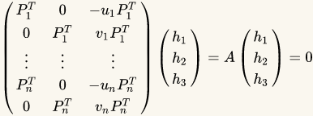
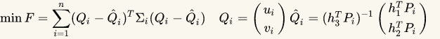
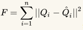
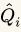
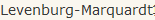
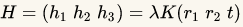
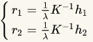
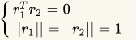
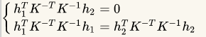

# 摄像机参数的估计

标定物为平面标靶，将世界坐标系置于标靶平面，原点设在标靶一角，x,y轴沿标靶平面，z方向垂直于标靶平面。
先不考虑畸变，标定摄像机参数，得到参数的线性初值；然后利用线性初值，就想非线性标定，得到畸变参数

H是一个齐次矩阵，有8个未知数，至少需要8个方程，每对对应点能提供两个方程，所以至少需要四个对应点，就可以算出世界平面到图像平面的单应性矩阵H

上式乘开可算得

对A进行SVD分解，即$A=U\Sigma V^T$,则以上方程组的解为$V$的最后一列

考虑噪声影响，设噪声是零均值高斯噪声，方差为$\Sigma_i$，由最大似然估计求解单应矩阵$H$，或定义目标函数$F$，求解$H$，使F取到最小

实际假设$\Sigma_i=\sigma_i^2I$，则，使用不考虑噪声情况下得到的单应矩阵H作为初值计算通过算法秋湖H的最终解

H是一个齐次矩阵，至少有8个未知数，至少需要8个方程，每对对应点能提供两个方程，至少需要四个对应点，H，计算结果与实际结果差距一个常数比例因子，即

那么

由于旋转矩阵是一个酉矩阵，r1 r2正交

可得约束条件

每个单应矩阵能提供两个方程，而内参矩阵包含五个参数，要求解至少需要三个单应矩阵，为了得到三个不同单应矩阵，至少使用三幅棋盘格图像进行标定。

