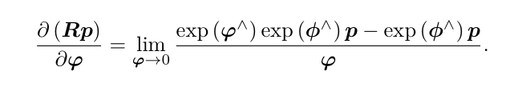
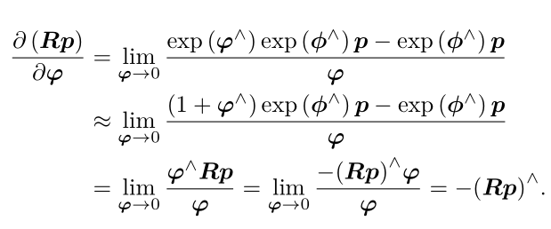

# SO(3)李代数上的求导
某个时刻位姿为$T$，观察到世界坐标位于$p$的点，产生观测数据$z$。由坐标变换得知：
$$z=Tp+w$$
由于观测噪声$w$的存在，$z$往往不可能精确的满足$z=Tp$的关系。通常会计算理想的观测与实际数据的误差。
$$e=z-Tp$$
假设由N个路标与观测点，有N个上式。那么对于相机的位姿估计，相当是寻找一个最优的$T$，使得整体误差最小化。
$$\min_T{}J(T)=\sum\limits_{i=1}^{N}||z_i-Tp_i||^2_2$$

求解此问题，需要计算目标函数$J$关于变换矩阵$T$。经常会构建与位姿相关的函数，然后讨论该函数关于位姿的导数，以调整当前的估计值。然而$SO(3),SE(3)$空间中没有定义良好的加法，只是群。若把T当成一个普通举证来处理优化，就必须对它进行加以约束。从李代数的角度来说，由于李代数由向量组成，具有良好的加法运算。因此，使用李代数解决求导问题思路分两种：
1. 用李代数表述姿态，根据李代数加法对李代数求导
2. 对李群左乘、右乘微小扰动，对该扰动进行求导，左扰动、右扰动模型

第一种方式对应李代数的求导模型，第二种对应扰动模型
李代数求导含有形式比较复杂的项

# 扰动模型（左乘）
对$R$进行一次扰动$\Delta{}R$，这个扰动可以乘在左边也可以在右边，以左扰动为例。设左扰动$\Delta{}R$对应的李代数$\varphi$，对其求导

# SE(3) 上的扰动模型求导
设左扰动$\Delta{}T=e^{\delta\xi^{\hat{}}}$,$\delta\xi=[\delta\rho,\delta\phi]$