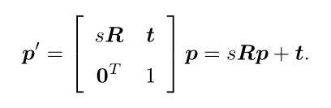

由于单目尺度不确定性与尺度漂移，若在单目SLAM中使用SE（3）表示位姿，整个SLAM过程中尺度会发生变化，在SE(3)中未能提I型安出来，因此，在单目情况下一般会显式吧尺度因子表达出来。用数学语言来说，对于位于空间的点$p$，在相机坐标系下要经过一个相似变换，而非欧式变换：

在相似变换中，将尺度$s$表达出来。同时作用在$p$的三个坐标之上，对$p$进行了一次缩放。与SO(3),SE(3)相似，相似变换对矩阵乘法构成群，称为相似变换群。

同样，其具有李代数、指数映射、对数映射等。