# 相机成像
相机成像系统中，包含了世界坐标系、相机坐标系、图像坐标系、像素坐标系
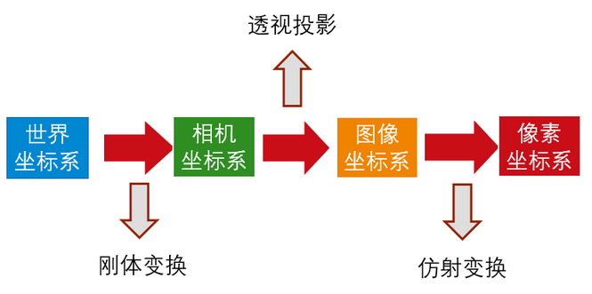
四个坐标系的转化关系
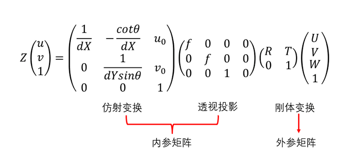

其中，（UVW）为在世界坐标系下一点的物理坐标，（u,v）为该点对应的像素坐标系下的像素坐标，Z为尺度因子
相机的内参矩阵
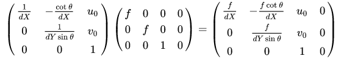
其中，f为像距，dX，dY分别表示X，Y方向上一个像素在相机感光板上的物理长度，u0，v0vu爱上过相机感光板中心在像素坐标系下的坐标，theta表示感光板的横边和纵边之间的角度，90°表示无误差

相机的外参矩阵
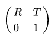
R为旋转矩阵，T表示平移矢量
单点无畸变的相机成像模型为
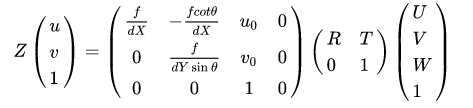

# 相机标定的目的
获取相机的内参与外参矩阵

# 畸变与畸变矫正
径向畸变公式（3阶）：
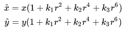
切向畸变公式：
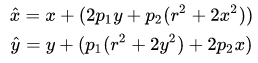
其中，（x，y），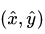分别为理想的无畸变的归一化图像坐标、畸变后的归一化图像坐标，为图像像素点到图像中心点的距离，即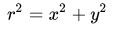

相机标定的第二个目的就是获得相机的畸变参数，如上式的k1,k2,k3,p1,p2，等，进而对拍摄的图片进行去畸变处理

# 张正友标定法
张正友标定法将世界坐标系固定于棋盘格上，则棋盘格上任一点的物理坐标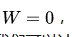，由于标定板的世界坐标系是人为事先定义好的，标定板上每一个格子大小是已知的，可以计算得到每一个角点在世界坐标系下的物理坐标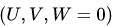
利用这些信息，每一个角点的像素坐标（u，v）、每一个角点在世界坐标系下的物理坐标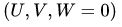，来进行相机的标定，获得相机的内外参矩阵、畸变系数。