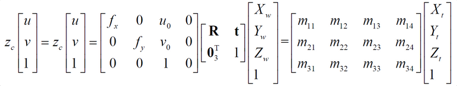

# 相机内外参标定

- 计算$m_{ij}$的解
- 分解内、外参数
- 考虑非线性项

# 张方法
张正友提出
简述
- 使用标定靶标摆多个位姿（可未知）
- 标定步骤
	- 对一个位姿计算单应矩阵
	- 有三个以上位姿，根据各单应矩阵计算线性相机三叔
	- 使用非线性优化方法计算非线性参数

## 求解单应矩阵
基本方程。平面靶标有四个点或者更多时，可求解H（差一个比例因子）
	 

建立内参数方程

- 根据R约束

- 响应每一个pose，可以得到上述两个方程