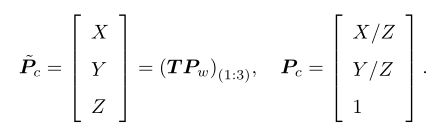
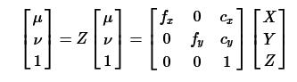
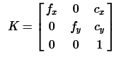
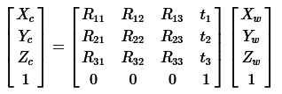
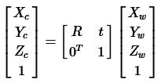
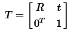

相机将三维世界中的坐标点（单位为米）映射到二维图像平面（单位为像素）的过程能用一个几何模型进行描述
针孔模型描述了一束光线通过针孔之后，在针孔背面投影成像的关系
由于相机镜头上透镜的存在，会使得光线投影到成像平面过程中会产生畸变
使用针孔模型和畸变模型来描述整个投影过程
这两个模型能够将外部的三维点投影到相机内部成像平面，构成相机的内参数

# 针孔相机模型

设O-xyz为相机坐标系，习惯性让z轴指向相机前方，x轴向右，y轴向下，O为摄像机的光心，也是针孔模型中的针孔。现实世界空间点P，经过小孔O投影后，落在物理成像平面O'-x'y'上，成像点为P‘。设P坐标为【xyz】，P'为【x'y'z'】，且物理成像平面到小孔距离为f（焦距）。那么，更具三角形相似关系，有：

其中负号表示成像为倒立的，简化模型，将成像平面对称到相机前方，和三维空间点放在摄像机坐标系同侧

**像素坐标系**
原点o'在图像左上角，u轴向右与x轴平行，v轴向下与y轴平行，像素坐标系与成像平面相差了一个缩放与原点的平移
p’的坐标于像素坐标[u,v]T关系为

其中，f的单位为米，为像素每米，所以的单位为像素。把该式写成矩阵形式，会更加间接，不过左侧需要用到齐次坐标：

传统习惯

**内参矩阵**$K$
**标定**

**外参**
考虑外参，之前我们使用的是$P$在相机坐标系下的坐标。由于相机在运动，所以P的相机坐标应该是它的世界坐标，记为pw，
根据相机当前位姿，变换到相机坐标系下的结果。相机的位姿由其旋转矩阵R和平移向量t描述，有：

最后一个式子隐含了一次齐次坐标到非齐次坐标的转换？，描述了P的世界坐标到像素坐标的投影关系。其中，相机的位姿R、t称为相机的外参。相对于不变的内参，外参会随着相机运动发生变化。同样也是SLAM中待估计的目标，代表机器人的轨迹。

上述两侧都是齐次坐标。因为齐次坐标乘上一个非零常数后表达同样的含义，所以可以简单的去掉Z
$P_{uv}=KTP_w$
但这样等号的意义就变成在齐次坐标下相等的概念，相差了一个非零常数。
右侧的TPw表示吧一个世界坐标系下的齐次坐标吗，转换到相机坐标系下，为了使得它与$K$相乘，需要取其前三维组成向量，因为$TP_w$最后一维为1.此时，对于这个三维向量，我们可以按照齐次坐标的方式，把最后一维度进行归一化处理，得到P在相机归一化平面上的投影

Pc可以看作一个二维的齐次坐标，称为归一化坐标，位于相机前方z=1处的平面。称为归一化平面。由于Pc经过内参之后得到像素坐标，可以将像素坐标[u,v]T看为对归一化平面上的点进行量化测量的结果。

**更好的内容：**
像素坐标$(\mu,ν)$,$P=(X,Y,Z)$为三维空间中的点
内参：

是**内参**

Pc是P在相机坐标系坐标
Pw是其在世界坐标系下的坐标
可以使用一个旋转矩阵R和一个平移向量t，将Pc变换为Pw
外参：

是**外参**