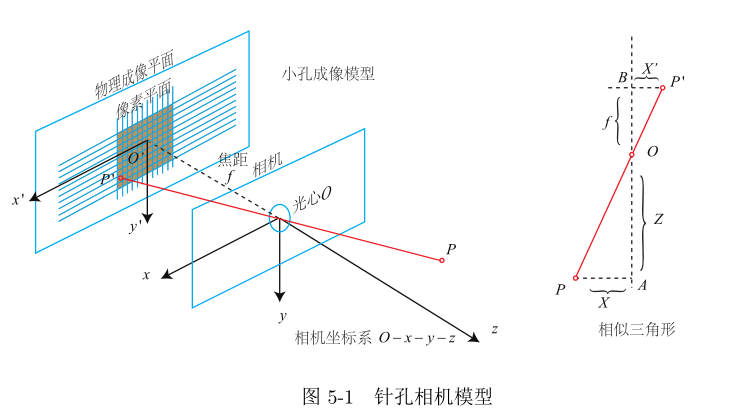
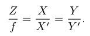
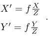
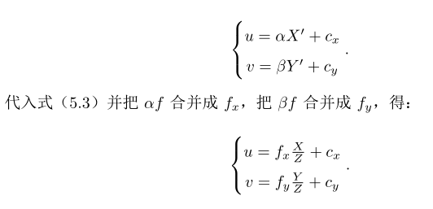
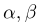
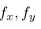
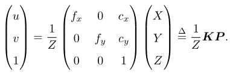
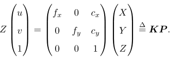

相机将三维世界中的坐标点（单位为米）映射到二维图像平面（单位为像素）的过程能用一个几何模型进行描述
针孔模型描述了一束光线通过针孔之后，在针孔背面投影成像的关系
由于相机镜头上透镜的存在，会使得光线投影到成像平面过程中会产生畸变
使用针孔模型和畸变模型来描述整个投影过程
这两个模型能够将外部的三维点投影到相机内部成像平面，构成相机的内参数

# 针孔相机模型

设O-xyz为相机坐标系，习惯性让z轴指向相机前方，x轴向右，y轴向下，O为摄像机的光心，也是针孔模型中的针孔。现实世界空间点P，经过小孔O投影后，落在物理成像平面O'-x'y'上，成像点为P‘。设P坐标为【xyz】，P'为【x'y'z'】，且物理成像平面到小孔距离为f（焦距）。那么，更具三角形相似关系，有：

其中负号表示成像为倒立的，简化模型，将成像平面对称到相机前方，和三维空间点放在摄像机坐标系同侧

**像素坐标系**
原点o'在图像左上角，u轴向右与x轴平行，v轴向下与y轴平行，像素坐标系与成像平面相差了一个缩放与原点的平移
p’的坐标于像素坐标[u,v]T关系为

其中，f的单位为米，为像素每米，所以的单位为像素。把该式写成矩阵形式，会更加间接，不过左侧需要用到齐次坐标：

传统习惯

