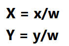
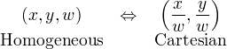
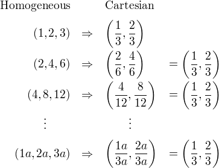
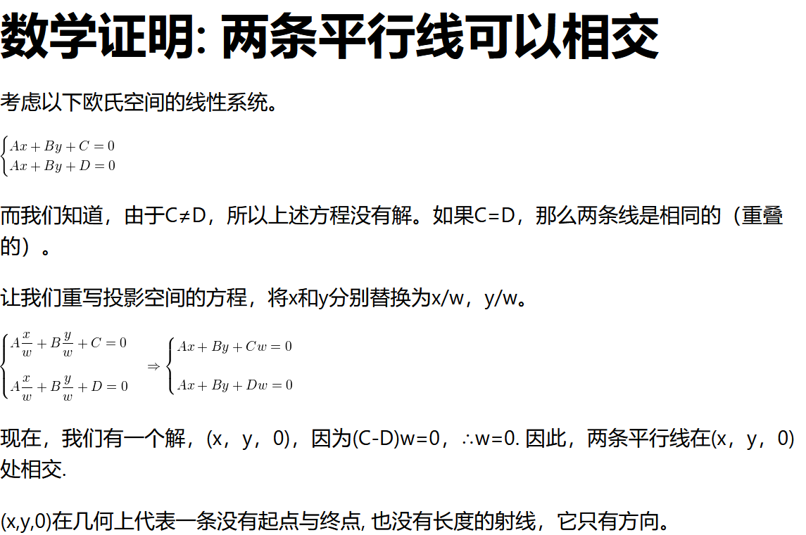

**齐次坐标**
经典的欧式空间坐标系不足以处理投影空间的问题

齐次坐标被提出用于解决投影空间的问题

例如：
欧式空间中两条平行线不相交，但是在投影空间中，如人在某一角度观察平行铁轨，会发现铁轨在无限远处相交于一点

齐次坐标是以n+1个数字来表示N维坐标的一种方式
构建齐次坐标系
二维为例：
我们只需在现有坐标中增加一个额外的变量w。因此，笛卡尔坐标中的一点，(X，Y)在齐次坐标中就变成了(x，y，w)。而笛卡儿坐标中的X和Y在齐次坐标中的x、y和w则重新表达为

**为何齐次**
如前所述，为了将齐次坐标（x，y，w）转换为笛卡尔坐标，我们只需将x和y除以w即可。

将Homogeneous转换为Cartesian，我们可以发现一个重要的事实。让我们看看下面的例子。

如你所见 (1, 2, 3), (2, 4, 6)和(4, 8, 12)这三个点对应于同一个欧氏点(1/3, 2/3). 而任何乘以a的数（1a，2a，3a）与欧氏空间中的（1/3，2/3）是同一个点。因此，这些点是 “homogeneous/齐次 “的，因为它们在欧氏空间（或笛卡尔空间）中代表同一个点。换句话说，齐次坐标是与乘数a不相关的。

