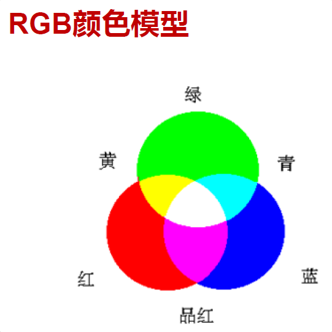

# Marr视觉计算机理论
Marr视觉计算机理论就是通过视觉捕捉物体的图像和位置，然后通过技术重构物体的三维特征；这个过程包括：
- 先通过图像提取出一些2维的初略图
- 然后对物体的形状的特征(法向量等)抽取并做一些初略的描述确定$2\cfrac{1}{2}$维图
- 最后综合所有特征形成物体的三维特征图。

# 数字成像系统
## 光通量

## 辐照度

## 光源类别

## 颜色光源

# 图像滤波

