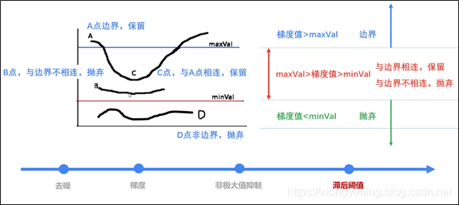
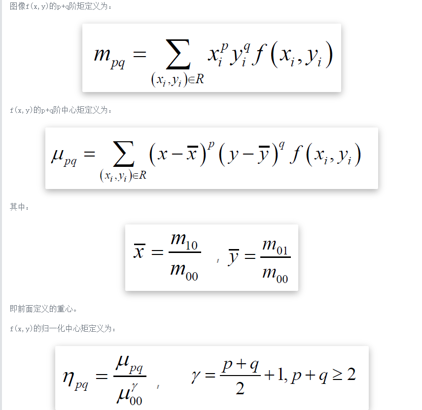
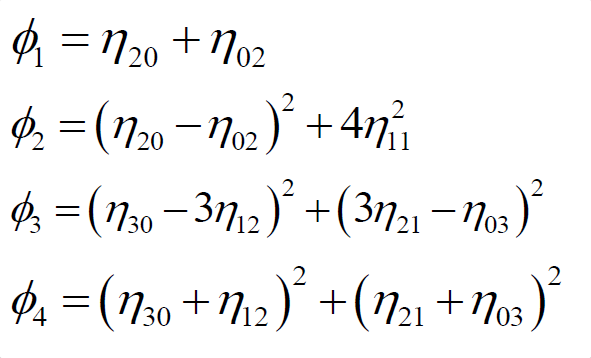

# Marr视觉计算机理论
Marr视觉计算机理论就是通过视觉捕捉物体的图像和位置，然后通过技术重构物体的三维特征；这个过程包括：
- 先通过图像提取出一些2维的初略图
- 然后对物体的形状的特征(法向量等)抽取并做一些初略的描述确定$2\cfrac{1}{2}$维图
- 最后综合所有特征形成物体的三维特征图。

# 数字成像系统
## 光通量

## 辐照度

## 光源类别

## 颜色光源

# 图像滤波
## 图像滤波与卷积

## 数学形态学滤波
### 膨胀
膨胀就是求局部最大值的操作，核B与图形卷积，即计算核B覆盖的区域的像素点的最大值，并把这个最大值赋值给参考点指定的像素。这样就会使图像中的高亮区域逐渐增长。

### 腐蚀
腐蚀就是求局部最小值的操作

### 开运算和闭运算
先腐蚀，在膨胀 闭运算：先膨胀，在腐蚀

先开后闭可有效的去除噪声

# 图像边缘检测
边缘检测的基本思想是通过检测每个像素和其邻域的状态，以决定该像素是否位于一个物体的边界上。如果一个像素位于一个物体的边界上，则其邻域像素的灰度值的变化就比较大。假如可以应用某种算法检测出这种变化并进行量化表示，那么就可以确定物体的边界。
- 边缘检测的实质是微分
- 实际中常用差分， X方向、Y方向

## Robert算子：一阶微分算子
对于图像来说，是一个二维的离散型数集，通过推广二维连续型求函数偏导的方法，来求得图像的偏导数，即在(x,y)处的最大变化率，也就是这里的梯度

## Prewitt算子：一阶微分算子

prewitt算子一般使用的是3*3的模板

## Sobel算子：一阶微分算子
Sobel 算子是在Prewitt算子的基础上改进的， 在中心系数上使用一个权值2， 相比较Prewitt算子，Sobel模板能够较好的抑制(平滑)噪声。

## Laplace算子：二阶微分算子
Laplace 算子是一种各向同性算子，在只关心边缘的位置而不考虑其周围的像素灰度差值时比较合适。Laplace算子对孤立像素的响应要比对边缘或线的响应要更强烈， 因此只适合用于无噪声图像。存在噪声情况下， 使用Laplace算子检测边缘之前需要先进行低通滤波

## LoG算子：二阶微分算子
Log 边缘检测则是先进行高斯滤波再进行拉普拉斯算子检测, 然后找过零点来确定边缘位置，很多时候我们只是知道Log 5*5 模板如上图所示。

## Canny算子：非微分算子
提出了连续边缘测度理论
### 基本原理
- 图象边缘检测必须满足两个条件:
    - 能有效的抑制噪声。
    - 必须尽量精确确定边缘的位置。
- 根据对信噪比与定位乘积进行测度，，得到最优化逼近算子。这就是Canny边缘检测算子。
- 类似与LoG边缘检测方法，也属于先平滑后求导数的方法。
### 算法步骤
1. 使用高斯滤波器，以平滑图像，滤除噪声。
2. 计算图像中每个像素点的梯度强度和方向。
3. 应用非极大值（Non-Maximum Suppression）抑制， 以消除边缘检测带着的杂散响应。
4. 应用双阈值（Double-Threshold）检测来确定真实的和潜在的边缘。
5. 通过抑制孤立的弱边缘最终完成边缘检测。

双阈值检测：

### 边缘检测总结
- 边缘检测的核心步骤为图像差分
- 常见边缘检测算子包括Robert算子，Sobel算子，LoG算子等，其中Sobel算子最为常用
- Canny算子的基本优点在于检测准确、对噪声稳健，在实际中广泛应用.

# 图像特征描述
## 简单描述
- 区域面积：区域包含的像素数
- 区域重心：

## 形状描述符
- 形状参数

注意：形状为圆形时：F=1；形状为其他时，F>1
- 偏心率：等效椭圆宽高比。
- 欧拉数：$E=C-H$
- 圆形性：
  

## 一般化描述
- 最小包围矩形（MER）

- 方向和离心率
  

## 不变矩
### 归一化的中心距

### 不变距
常用的是7个不变距，即对平移、旋转和尺度变化保持不变。可由归一化的二阶和三阶中心距得到。

# 图像分割

