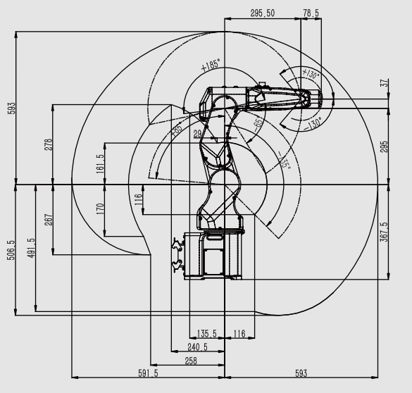

[机器人详细参数]((https://www.efort.com.cn/web/upload/2022/04/20/16504191658016cu573.pdf))



$$
\begin{cases}
\begin{array}{r}
\mathcal{S}_1 = [0,&0,&1,&0,&0,&0]^T \\
\mathcal{S}_2 = [0,&1,&0,&-367.5,&0,&0]^T \\
\mathcal{S}_3 = [0,&1,&0,&-662.5,&0,&0]^T \\
\mathcal{S}_4 = [1,&0,&0,&0,&699.5,&0]^T \\
\mathcal{S}_5 = [0,&1,&0,&-699.5,&0,&295.5]^T \\
\mathcal{S}_6 = [1,&0,&0,&0,&699.5,&0]^T \\
\end{array}
\end{cases}
$$

空间运动旋量
$$
\begin{cases}
\mathcal{V}_s = \begin{bmatrix}
[\omega_s] & v_b \\
0 & 1
\end{bmatrix} \\
[\omega_s] = \begin{bmatrix}
0 & -\omega_3 & \omega_2 \\
\omega_3& 0 & -\omega_1 \\
-\omega_2 & \omega_1 & 0 \\
\end{bmatrix}
\end{cases}
$$
空间雅可比
$$
\begin{align}
\mathcal{V}_s=&\begin{bmatrix}
J_{s1} & J_{s2} & \cdots & J_{sn}
\end{bmatrix}\begin{bmatrix}
\dot{\theta}_1 \\
 \dot{\theta}_2 \\
  \vdots \\
  \dot{\theta}_n
\end{bmatrix} \\
 = &J_s(\theta)\dot{\theta}
\end{align}
$$

$$
\begin{cases}
J_{s_1} = \mathcal{S}_1 \\
J_{s_i} = Ad_{e^{[\mathcal{S}_1]\theta_1}e^{[\mathcal{S}_2]\theta_2}\cdots{}e^{[\mathcal{S}_n]\theta_n}}
\end{cases}
$$

刚体运动的指数坐标表达
$$
e^{[\mathcal{S}]\theta}=\begin{bmatrix}
e^{[\omega]\theta} & G(\theta)v \\
0 & 1
\end{bmatrix}=
\begin{bmatrix}
R & p \\
0 & 1
\end{bmatrix}
$$
$$e^{[\omega]{\theta}}=I+sin\theta[\omega]+(1-cos\theta)[\omega]^2$$
$$
G(\theta)=I\theta + (1-cos\theta)[\omega] + (\theta - sin\theta)[\omega]^2
$$
伴随变换矩阵
$$
[Ad_T]=\begin{bmatrix}
R & 0 \\
[p]R & R
\end{bmatrix}
$$

``` bash?linenums
enter code here
```