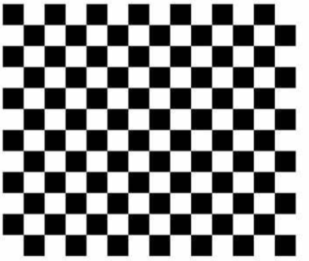

``` bash
rosrun camera_calibration cameracalibrator.py --size 6x9 --square 0.014 image:=/camera/rgb/image_raw
```
(1) size指的是：棋盘格内部的角点的行列数（注意：不是棋盘格的行列数，如下图棋盘格的行列数分别为12、14，而内部角点的行列数分别是11、13。

(2) square 是棋盘格每个格子的边长（可以自己用尺子量一下）
