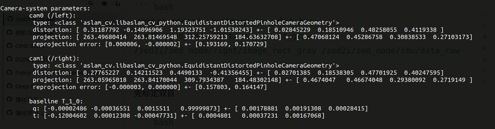

## 相机标定
ZED2i相机自己发布的话题中，带有原始图像输出和矫正畸变之后的图像输出。以左目相机为例：
- 原始图像话题：`/zed2i/zed_node/left_raw/image_raw_gray`
- 矫正畸变之后话题：`/zed2i/zed_node/left/image_rect_gray`

其相机参数可以不用标定，我们使用矫正畸变之后的图像输出，其相机参数话题为：`/zed2i/zed_node/left/camera_info`
相机参数如下：

``` 
height: 360
width: 640
distortion_model: "plumb_bob"
D: [0.0, 0.0, 0.0, 0.0, 0.0]
K: [256.2857971191406, 0.0, 313.02838134765625, 0.0, 256.2857971191406, 181.3371124267578, 0.0, 0.0, 1.0]
R: [1.0, 0.0, 0.0, 0.0, 1.0, 0.0, 0.0, 0.0, 1.0]
P: [256.2857971191406, 0.0, 313.02838134765625, 0.0, 0.0, 256.2857971191406, 181.3371124267578, 0.0, 0.0, 0.0, 1.0, 0.0]

```

## IMU标定
IMU的参数可以自行标定。ZED2i给出了矫正之后的IMU数据，先使用矫正之后的IMU数据进行实验。
其话题为：`/zed2i/zed_node/imu/data`，IMU参数设置为`0`。

## 相机加IMU联合标定。
相机加IMU联合标定主要标定的是相机与IMU之间的位姿转换矩阵$T$，其可以从ZED2i相机的ros话题中获取。其话题为：`/zed2i/zed_node/left_cam_imu_transform`

参数为：

``` bash
translation: 
  x: -0.0020000000949949026
  y: -0.023000003769993782
  z: 0.0002200000308221206
rotation: 
  x: -0.0010066175600513816
  y: -0.0008097228710539639
  z: 0.0012328496668487787
  w: 0.9999983906745911
```
变换为旋转矩阵为：

``` 
[  0.9999956, -0.0024641, -0.0016219;
   0.0024673,  0.9999949,  0.0020112;
   0.0016170, -0.0020152,  0.9999967 ]
```
其位姿转移矩阵为：

``` bash
[  0.9999956, -0.0024641, -0.0016219, -0.0020000000949949026;
   0.0024673,  0.9999949,  0.0020112, -0.023000003769993782;
   0.0016170, -0.0020152,  0.9999967,  0.0002200000308221206;
   0,          0,          0,          0]
```

## 运行SLAM 
### ORBSLAM3
单目加imu使用以下命令：
``` bash
rosrun ORB_SLAM3 Mono_Inertial /home/hz/share/workspace/slam/ORB_SLAM3_NOETIC/Vocabulary/ORBvoc.txt /mnt/share/workspace/slam/clib/zed2i/orbslam3_mi.yaml true /usb_cam/image_raw:=/zed2i/zed_node/left/image_rect_gray /imu:=/zed2i/zed_node/imu/data
```

双目加imu使用以下命令：

``` bash
rosrun ORB_SLAM3 Stereo_Inertial Vocabulary/ORBvoc.txt \
           Examples/zed2/test_stereo_imu.yaml true \
           /camera/left/image_raw:=/zed2/zed_node/left/image_rect_gray \
           /camera/right/image_raw:=/zed2/zed_node/right/image_rect_gray \
           /imu:=/zed2/zed_node/imu/data

```

### VINS
使用以下命令：
``` bash
rosrun ORB_SLAM3 Stereo_Inertial Vocabulary/ORBvoc.txt \
           Examples/zed2i/test_stereo_imu.yaml true \
           /camera/left/image_raw:=/zed2i/zed_node/left/image_rect_gray \
           /camera/right/image_raw:=/zed2i/zed_node/right/image_rect_gray \
           /imu:=/zed2i/zed_node/imu/data
```

# 手动标定
## 相机标定
https://blog.csdn.net/weixin_42905141/article/details/100024572
``` bash
width
640

height
360

[narrow_stereo]

camera matrix
252.598114 0.000000 310.811093
0.000000 254.370488 165.901747
0.000000 0.000000 1.000000

distortion
-0.009218 0.007314 -0.001107 -0.000942 0.000000

rectification
1.000000 0.000000 0.000000
0.000000 1.000000 0.000000
0.000000 0.000000 1.000000

projection
255.234985 0.000000 309.743269 0.000000
0.000000 256.760559 164.891553 0.000000
0.000000 0.000000 1.000000 0.000000

```
## IMU标定
https://blog.csdn.net/weixin_43247057/article/details/101695333

``` yaml
%YAML:1.0
---
type: IMU
name: data_raw
Gyr:
   unit: " rad/s"
   avg-axis:
      gyr_n: 1.2996384980293932e-03
      gyr_w: 4.1408494335749790e-06
   x-axis:
      gyr_n: 1.4040886721777006e-03
      gyr_w: 6.1436879299344365e-06
   y-axis:
      gyr_n: 1.2338859937314124e-03
      gyr_w: 4.0329532743445382e-06
   z-axis:
      gyr_n: 1.2609408281790669e-03
      gyr_w: 2.2459070964459627e-06
Acc:
   unit: " m/s^2"
   avg-axis:
      acc_n: 1.4575366483065367e-02
      acc_w: 4.5523022034636923e-04
   x-axis:
      acc_n: 1.6237479516608512e-02
      acc_w: 4.4995436093994310e-04
   y-axis:
      acc_n: 1.1876031528164025e-02
      acc_w: 2.9518282461217987e-04
   z-axis:
      acc_n: 1.5612588404423563e-02
      acc_w: 6.2055347548698467e-04

```

## 联合标定，数据录制
降低图像数据频率：

``` bash
rosrun topic_tools throttle messages /zed2i/zed_node/left/image_rect_gray 4.0 /left

rosrun topic_tools throttle messages /zed2i/zed_node/right/image_rect_gray 4.0 /right
```

录制数据

``` bash
rosbag record -O stereo_calibra.bag /left /right /zed2i/zed_node/imu/data_raw
```

每个轴做个3、4次，然后在标定板前做平移，上下、左右、前后。做完之后空中画几个８字
记录数据：

``` bash
 rosbag record -o stmono_imu_clib.bag /zed2i/zed_node/left/image_rect_gray /zed2i/zed_node/right/image_rect_gray /zed2i/zed_node/imu/data_raw
```

先标定双目

``` bash
kalibr_calibrate_cameras --target zed2i/kalibr/board11x8-20.yaml --topics /left /right --models pinhole-equi pinhole-equi  --bag data/stereo_calibra.bag
```


再联合标定IMU

``` bash
kalibr_calibrate_imu_camera --target april_6x6.yaml --cam camchain.yaml --imu imu_adis16448.yaml --bag /home/dji/db/stero_dji_kalibr/stereo/imu_stereo_subset.bag --bag-from-to 5 45
```


## 搭建kalibr环境

``` bash
docker pull stereolabs/kalibr
```
运行容器
``` bash
xhost +local:root

docker run -itd -e "DISPLAY" -e "QT_X11_NO_MITSHM=1" -v "/tmp/.X11-unix:/tmp/.X11-unix:rw" -v /home/hz/share/workspace/slam/clib/:/data --name kalibr stereolabs/kalibr bash
```

标定
``` bash
kalibr_calibrate_imu_camera --target zed2i/kalibr/board.yaml --cam zed2i/kalibr/cam_left.yaml --imu zed2i/kalibr/imu.yaml --bag data/stmono_imu_clib_2022-10-03-13-30-15.bag 
```