## 自治系统：
对于一个微分系统
$$\dot{x}=f(x,t)$$
（1）如果系统中f与t无关，或者说中不显含时间变量t，则系统称为自治系统；
（2）否则，如果f中显含时间变量t，则系统称为非自治系统。

## Lipschitz连续性
利普希茨连续函数限制了函数改变的速度
对于在实数集的子集的函数$D\subseteq\mathbb{R}\to\mathbb{R}$,存在常数$K$,对于f 最小的常数K 称为 f 的利普希茨常数。
$$|f(a)-f(b)|\leq{}K|a-b|$$

## 柯西-利普希茨定理
若已知y(t)有界，f 符合利普希茨条件，则微分方程初值问题
$$y(t)=f(t,y(t)),\ y(t_0)=y_0$$
刚好有一个解。

## 传统稳定性
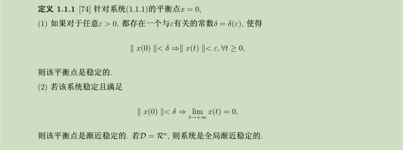

## 有限时间稳定性

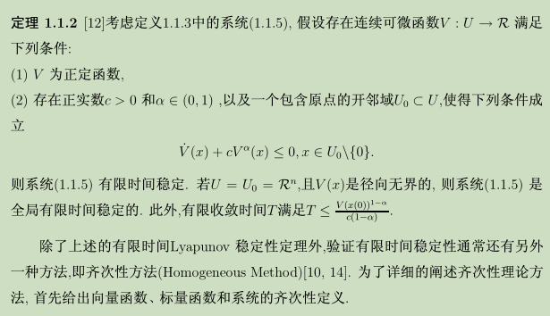

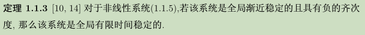
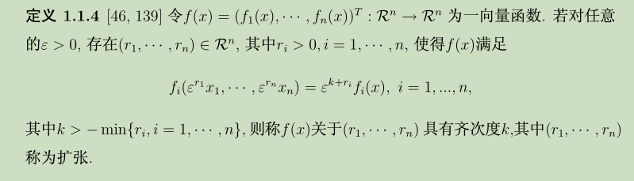

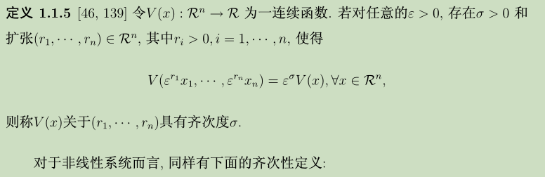

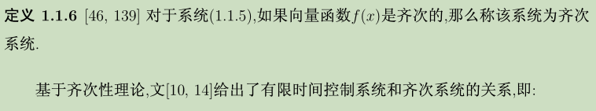
## 引理
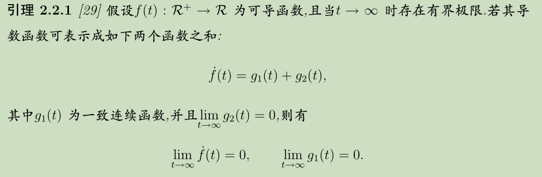
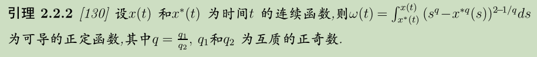
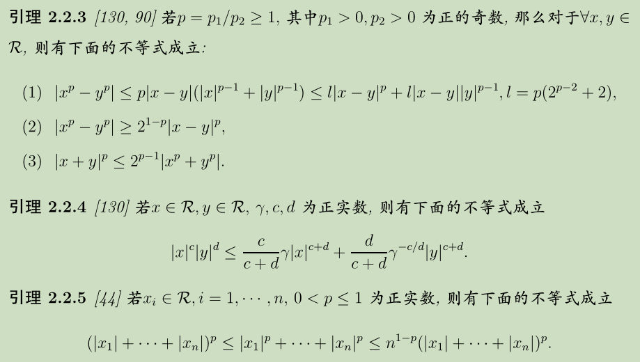
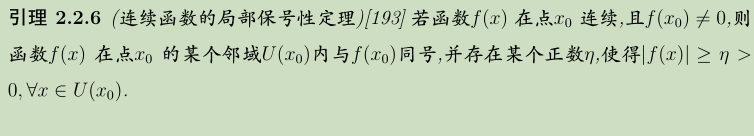

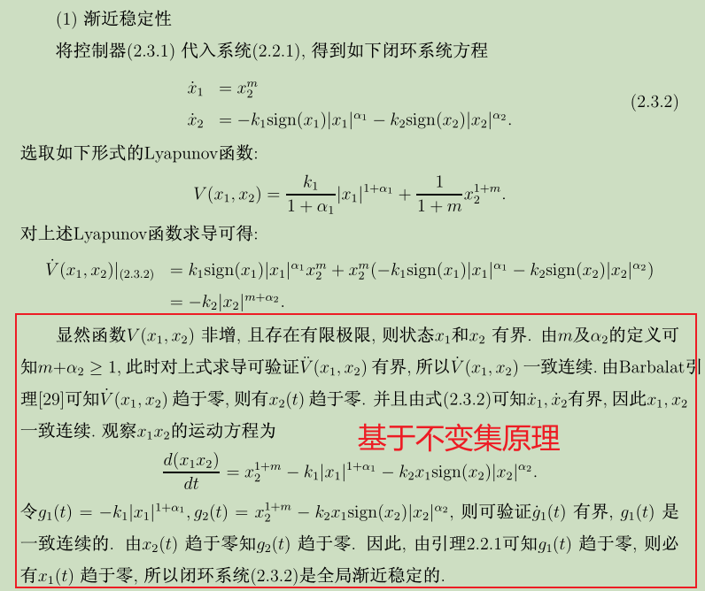
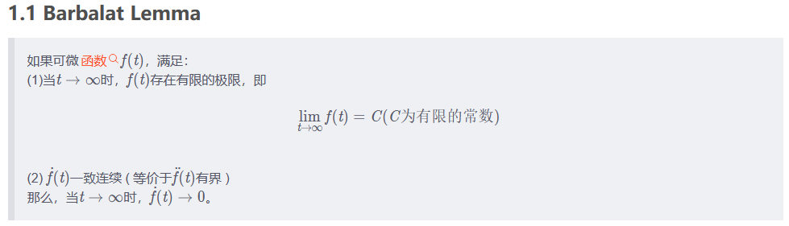
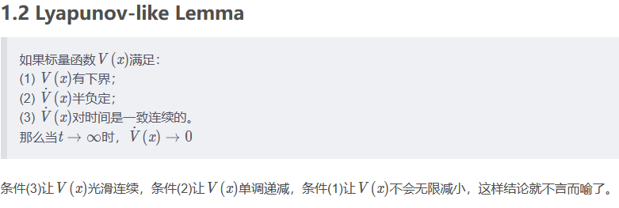
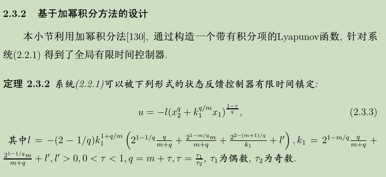

