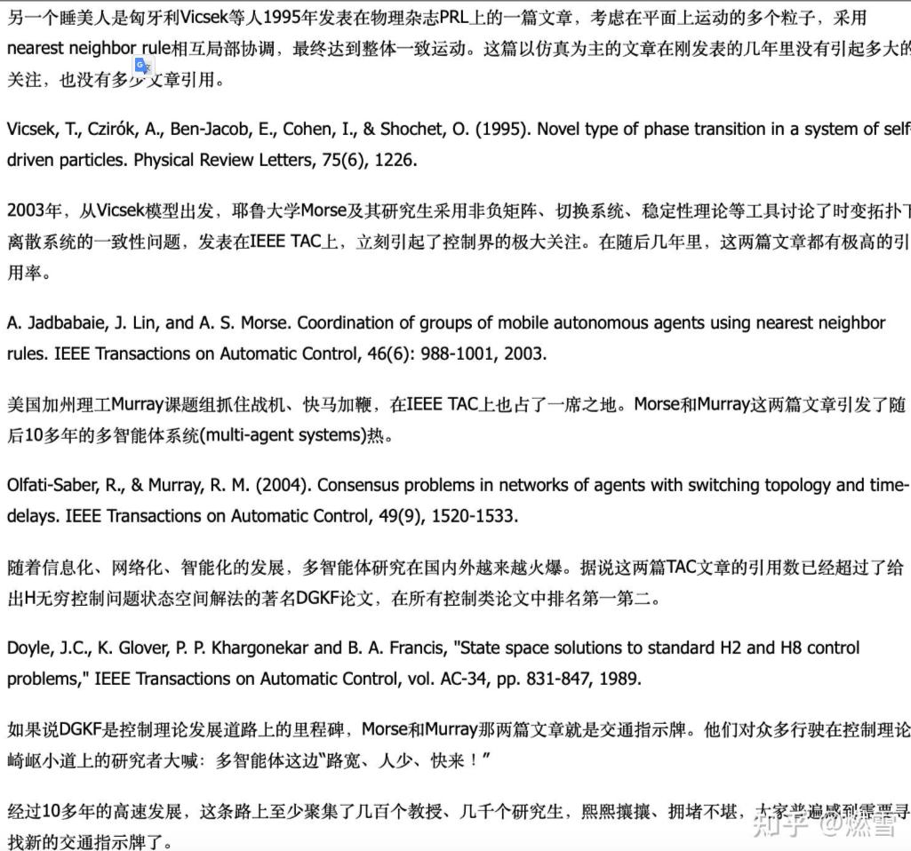

MAS CONSENSUS从03年Morse的TAC

04年Olfati Saber的TAC

04年左右Ren Wei的无人车编队等几个开创性工作

Prescribed Performance

Event trigger

Fully Distributed

Prescribed Performance

Attack

把mas和control的思想向其他新兴领域迁移

未知拓扑

MARL的置换不变性和置换等变性

香港的刘云辉
北航的董希望
宾大的kumar为代表的，还有eth，kth的那些