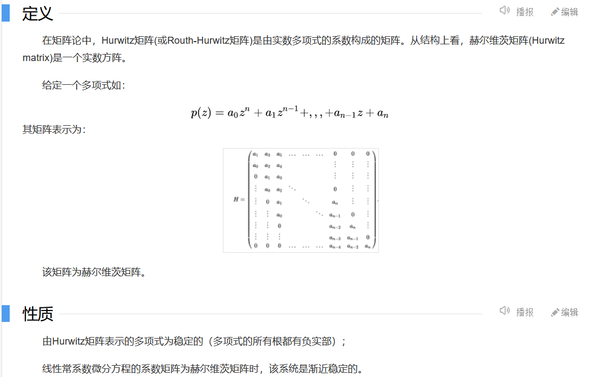

$$\lim_{s\to0}s\dot{s}\leq0$$
$$v=s^2$$
$\to$李雅普诺夫稳定

## 滑模变结构控制的定义
$\dot{x}=f(x,u,t)$
需确定切换函数
$s(x)$
求解控制函数
$u(x)$
使得
1. 滑动模态存在
2. 满足可达性条件，有限时间内达到切换面
3. 保证滑模运动稳定性
4. 达到控制系统的动态品质要求

## 滑模面参数设计
$$\dot{x}=Ax+bu$$
$$s(x)=C^Tx$$
~~$C$满足$C^TP$为*Hurwitz*~~
p为拉普拉斯算子

即$p^{n-1}+c_{n-1}p^{n-2}+...+c_1$满足劳斯判据

***Hurwitz***

