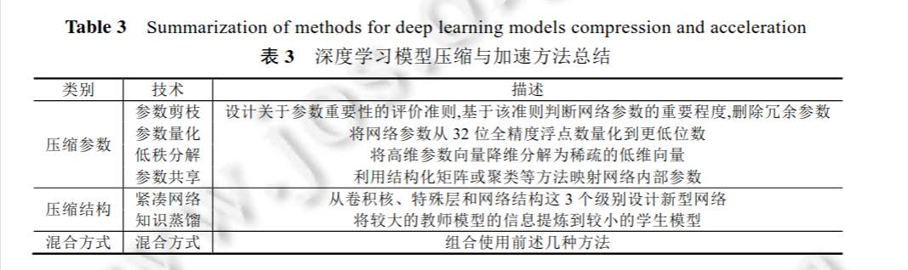
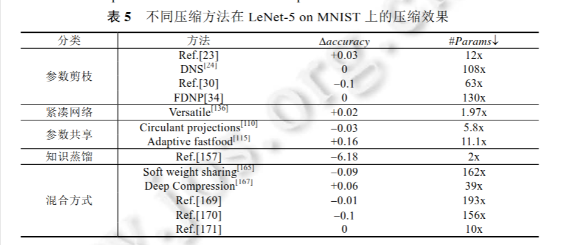
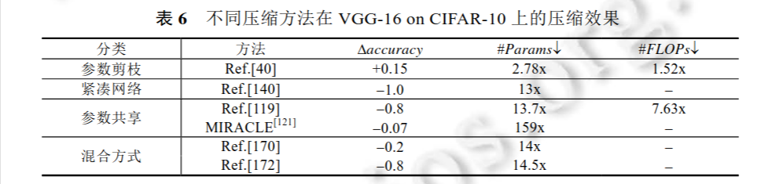
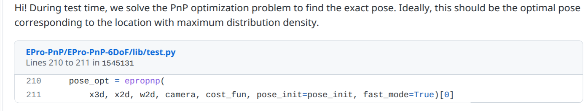

[综述论文](file:///home/hz/Downloads/%E6%B7%B1%E5%BA%A6%E5%AD%A6%E4%B9%A0%E6%A8%A1%E5%9E%8B%E5%8E%8B%E7%BC%A9%E4%B8%8E%E5%8A%A0%E9%80%9F%E7%BB%BC%E8%BF%B0.pdf)







使用docker

``` bash
docker run  -it --name t15 --gpus all --ipc=host -v /home/hz/E/workspace/torch1.5:/data pytorch/pytorch
```

https://blog.csdn.net/wd18508423052/article/details/116306096
内存问题


``` bash
docker run -it --name det \
--gpus all \
--ipc=host \
-v /home/hz/E/workspace/torch1.5:/data pinto0309/epropnpdet \
-e DISPLAY=unix$DISPLAY
```




加入数据/程序和ros
``` bash
docker run -it --name det2ros \
--privileged \
--net=host \
-e DISPLAY=$DISPLAY \
--env QT_X11_NO_MITSHM=1 \
--env NVIDIA_VISIBLE_DEVICES=${NVIDIA_VISIBLE_DEVICES:-all}\
--env NVIDIA_DRIVER_CAPABILITIES=${NVIDIA_DRIVER_CAPABILITIES:+$NVIDIA_DRIVER_CAPABILITIES,}graphics \
--group-add video \
--device=/dev/dri \
-v /tmp/.X11-unix:/tmp/.X11-unix \
--volume="$HOME/.Xauthority:/root/.Xauthority:rw" \
--gpus all \
--ipc=host \
-v /home/hz/E/workspace/torch1.5:/home/user/workdir \
hz/eprowithros:v1

```