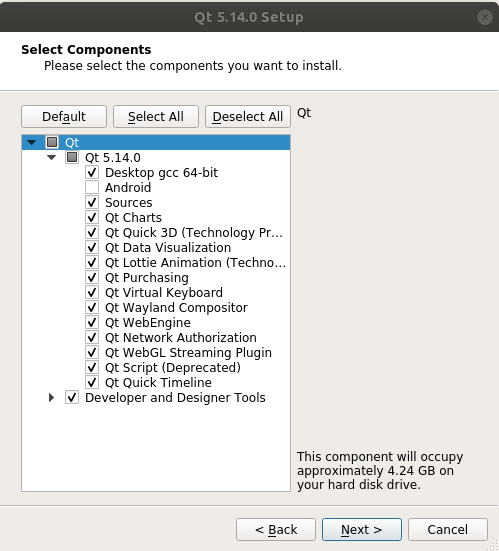

### 使用系统
**系统版本**：ubuntu18.04
在安装完成系统之后不要执行任何操作，重启电脑之后直接进行开发环境的配置，以免配置开发环境时遇到意料之外的问题。

### 配置python与svn
系统安装后的设置运行以下命令

``` sh
sudo apt-get update
sudo apt-get install -y cmake python python-pip python-svn svn-workbench
pip install getmac bason pymongo faulthandler xlrd requests peewee mysqlclient
```
为了开发环境的简洁与配置快速，不使用虚拟环境与conda，安装的python版本应为`2.7`。
以上安装的软件中，`cmake`是编译`c++`的工具，`python`、`python-pip`是`python2`开发环境与`python`包管理工具，`python-svn`、`svn-workbench`是项目开发需要用到的项目版本管理工具，用于协同开发。
使用`pip`安装的模块中，`getmac`用于获取本机*mac地址*；`faulthandler`用于段错误溯源（在使用多线程时可能会遇到段错误）；`bason`、`pymongo`是一些其他包的依赖；`xlrd`是用于操作`Excel`文件数据的包；`requests`用于计算机网络通讯；`peewe`用于操作数据库；`mysqlclient`是`peewee`的底层驱动。

### 安装Qt5.14
在Qt官网上注册账号后，运行以下命令安装QT

``` sh
cd ~
wget https://download.qt.io/archive/qt/5.14/5.14.0/qt-opensource-linux-x64-5.14.0.run
chmod a+x qt-opensource-linux-x64-5.14.0.run
./qt-opensource-linux-x64-5.14.0.run
```

点击*next*到达这一安装步骤之后，勾选除*Android*之外的所有选项进行安装，其他选项默认即可。


这一步安装之后还不能在python中调用PyQt5，需要安装ros之后方可调用

### 安装ROS Melodic
http://wiki.ros.org/melodic/Installation/Ubuntu
1. 加入`ros`源。运行以下命令：
	``` sh
	sudo sh -c '. /etc/lsb-release && echo "deb http://mirrors.tuna.tsinghua.edu.cn/ros/ubuntu/ `lsb_release -cs` main" > /etc/apt/sources.list.d/ros-latest.list'
	sudo apt install curl
	curl -s https://raw.githubusercontent.com/ros/rosdistro/master/ros.asc | sudo apt-key add -
	```
2. 安装`ros-melodic`。运行以下命令：
	```
	sudo apt update
	sudo apt install ros-melodic-desktop-full
	```
3. 设置`ros`环境。运行以下命令：
	```
	echo "source /opt/ros/melodic/setup.bash" >> ~/.bashrc
	source ~/.bashrc
	```
4. 安装依赖。运行以下命令：
	```
	sudo apt install python-rosdep python-rosinstall python-rosinstall-generator python-wstool build-essential
	```
在安装ros之后，就可以在python中成功调用PyQt5

### 安装r2ware
`glfw3`与`libfreenect2`是编译`r2ware`时的依赖，需要安装之后才能成功编译`r2ware`
##### 安装glfw3
运行以下命令

``` sh
cd ~
wget https://github.com/glfw/glfw/releases/download/3.3.4/glfw-3.3.4.zip
unzip glfw-3.3.4.zip 
cd glfw-3.3.4/ && mkdir build && cd build && cmake .. && make && sudo make install
```
##### 安装libfreenect2
运行以下命令

``` sh
pip install PyTurboJPEG
sudo apt-get -y install libturbojpeg0-dev
cd ~
git clone https://github.com/OpenKinect/libfreenect2
cd libfreenect2-master && mkdir build && cd build && cmake .. && make && sudo make install
```

##### 安装r2ware
1. 使用svn下载r2ware包
2. 运行以下命令
	``` sh
	mkdir -p ~/workplace/catkin_ws/src
	cd ~/workplace/catkin_ws/src
	catkin_init_workspace
	```
3. 将下载的r2ware包中的文件拷贝到`~/workplace/catkin_ws/src`中
4. 运行以下命令
	``` sh
	sudo apt-get install -y ros-melodic-jsk-rviz-plugins libusb-dev ros-melodic-serial ros-melodic-velodyne ros-melodic-grid-map ros-melodic-urg-c fonts-glewlwyd glew-utils glewlwyd glewlwyd-common libglew-dev libglew2.0 libspnav-dev 
	cd ~/workplace/catkin_ws
	catkin_make
	```
	`r2ware`的编译过程较长，请耐心等待，同时，在编译时可能出现机器卡死的现象，大部分时候等待一段时间之后就会回归正常，若超过20分钟机器依旧处于卡死状态，则可以强制重启机器，重启机器之后，输入以下命令继续编译`r2ware`。
	``` sh
	cd ~/workplace/catkin_ws
	catkin_make
	```
	若在编译过程中遇到`recipe for target failed`的错误，则手动删除`~/workplace/catkin_ws`下的`build`和`devel`文件夹再重新编译即可。


