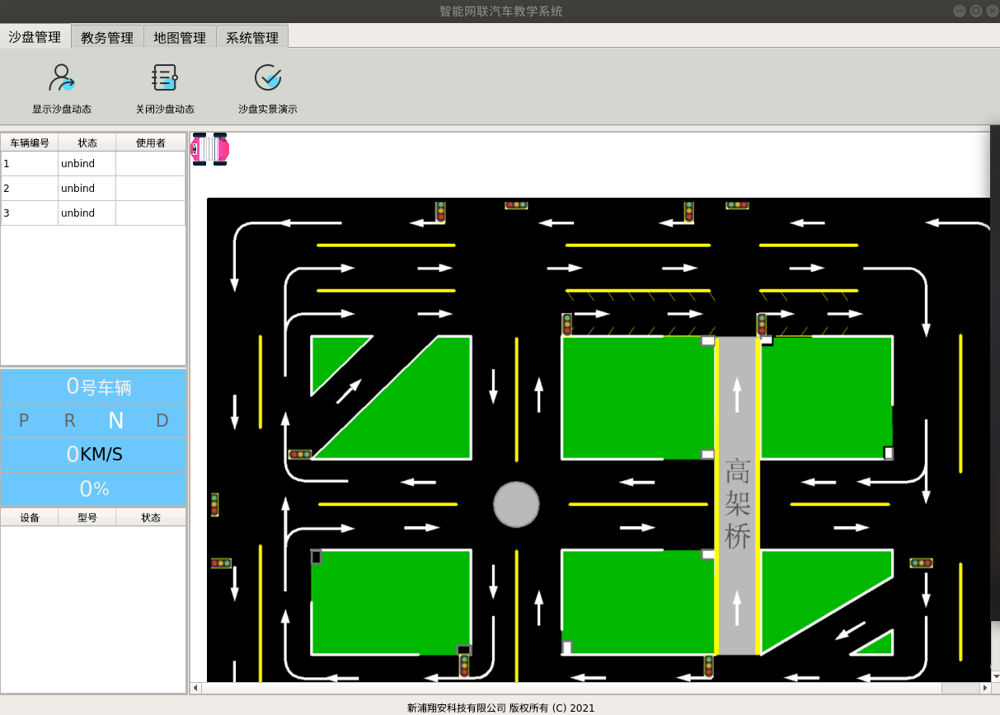

# 显示沙盘动态
### 概述
1. 用户点击显示沙盘动态按钮
2. 系统访问[获取车辆当前运行数据接口](http://192.168.10.106:8080/project/3?p=304)，获取对应的车辆运行数据
3. 系统根据车辆运行数据进行[坐标变换，偏移校准](http://192.168.10.106:8080/project/3?p=301)，最终在沙盘上正确显示车辆
### 具体逻辑
用户点击沙盘动态时，会触发`self.ui.button_sandbox_start.clicked`信号。
``` py
# ui/admin.py
# 显示沙盘动态
self.ui.button_sandbox_start.clicked.connect(self.sand_box.start_sandbox)
```
同时`self.ui.button_sandbox_start.clicked`信号连接到`self.sand_box.start_sandbox`函数。

``` py
# ui/sandbox.py
    def start_sandbox(self):
        self.flag_sandbox_start = True
        if not self.flag_start_update_vehicles_running_data_service:
            start_thread_work(self.update_vehicles_running_data_service)
            self.flag_start_update_vehicles_running_data_service = True
```

`self.sand_box.start_sandbox`函数开启线程运行`self.update_vehicles_running_data_service`函数。

``` py
# ui/sandbox.py
    def update_vehicles_running_data_service(self):
        while True:
            time.sleep(0.1)
            if self.flag_sandbox_start:
                self.update_vehicles_running_data()
```

`self.update_vehicles_running_data_service`函数调用`self.update_vehicles_running_data`函数，注意，在此函数中，每次循环都会检查标志位`self.flag_sandbox_start`，若标志位为`False`则关闭沙盘动态。

``` py
# ui/sandbox.py
    def update_vehicles_running_data(self):
        for vehicle_id in self.vehicles:
            state, result = server_communication.communicate({
                'action': 'admin_get_vehicle_current_running_data',
                'info': {
                    'vehicle_id': vehicle_id
                }
            })
            if state and result['state']:
                self.update_vehicle_running_data(self.vehicles[vehicle_id], result['info'])
                if self.master.selected_vehicle and 'id' in self.master.selected_vehicle:
                    if vehicle_id == self.master.selected_vehicle['id']:
                        self.master.update_selected_vehicle_status(result['info'])
        pass
```
`self.update_vehicles_running_data`函数也就是最终执行的函数，在此函数中，访问了[车辆当前运行数据接口](http://192.168.10.106:8080/project/3?p=304)并获得了车辆运行数据，在获得车辆运行数据后。
- 调用`self.update_vehicle_running_data`更新车辆沙盘中车辆的位置
- 调用`self.master.update_selected_vehicle_status`更新管理员首页车辆运行状态数据

沙盘运行时界面如下：


#  关闭沙盘动态
### 概述
1. 用户点击关闭沙盘动态按钮
2. 沙盘内小车停止运行
### 具体逻辑

根据[显示沙盘动态](http://192.168.10.106:8080/project/3?p=303)可知，关闭沙盘动态只需置标志位`self.flag_sandbox_start`为`False`即可。

当用户点击关闭沙盘动态按钮时，会触发`self.ui.button_sandbox_shutdown.clicked`信号，调用`self.sand_box.stop_sandbox`函数。

``` py
# ui/admin.py
        # 关闭沙盘动态
        self.ui.button_sandbox_shutdown.clicked.connect(self.sand_box.stop_sandbox)
```
`self.sand_box.stop_sandbox`函数如下：

``` py
# ui/sandbox.py
    def stop_sandbox(self):
        self.flag_sandbox_start = False
```
其置标志位`self.flag_sandbox_start`为`False`，关闭了沙盘动态显示。

# 沙盘实景演示
### 概述
1. 用户点击沙盘实景演示按钮
2. 系统弹出窗口显示沙盘场地实时摄像头图像

摄像头图像获取使用萤石云开放平台提供的https API，实现对萤石云摄像机视频的远程访问和播放。
主要流程如下：

1. 在萤石云开放平台上创建应用，并由此获得访问萤石云所需要的 appKey和appSecret
2. 调用接口，获得访问必须的accessToken
3. 调用接口，获得要访问的摄像头设备序列号（deviceSerial）
4. 调用接口，根据获得的设备序列号，得到视频的Url地址
5. 使用opencv的imShow函数，实现视频播放