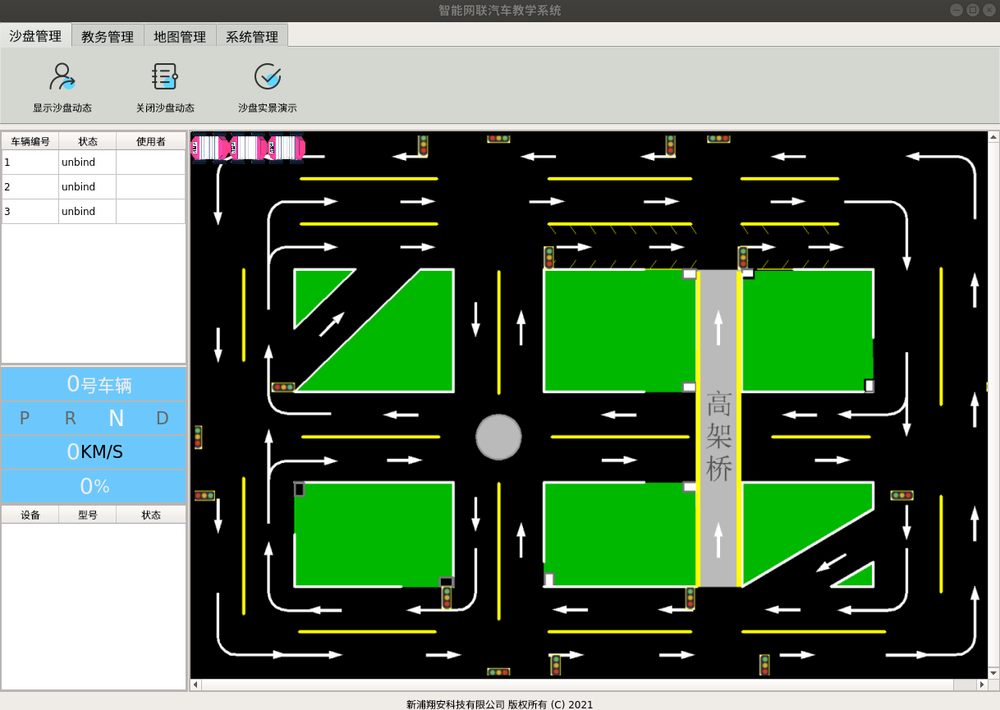

### 概述
用户通过[登录界面](http://192.168.10.106:8080/project/3?p=249)登录之后即[跳转](http://192.168.10.106:8080/project/3?p=295)到首页。
1. 载入所有车辆信息，显示【在网车辆列表】：全部在网车辆状态（车辆编号、状态以及使用人员
2. 显示界面

### 具体逻辑
在管理员端首页初始化时刻，会载入所有车辆信息，显示到【在网车辆列表】上，其在程序中的核心代码如下，其使用一个线程运行了`load_vehicles`函数。

``` py
# ui/admin.py
start_thread_work(self.load_vehicles)
```

`load_vehicles`函数如下：

``` py
# ui/admin.py
def load_vehicles(self):
        """
        Write by huzheng
        """
        # 设置列自适应，用户不可拖动
        self.ui.table_vehicles.horizontalHeader().setSectionResizeMode(QHeaderView.Stretch)
        state, result = self.communication.communicate({
            'action': 'admin_get_all_vehicle_info',
            'info': '',
        })
        if isinstance(result['info'], list):
            for vehicle in result['info']:
                self.vehicles[vehicle['id']] = vehicle
        self.signal_load_vehicles.emit()
```
可以看到其访问了[ 获取所有车辆信息](http://192.168.10.106:8080/project/3?p=300)接口，存储了车辆信息并触发了`signal_load_vehicles`信号。
`signal_load_vehicles`信号被连接到`self.__load_vehicles`函数。
``` py
# ui/admin.py
self.signal_load_vehicles.connect(self.__load_vehicles)
```
`__load_vehicles`函数调用了`self.sand_box.load_vehicles`函数和`self.add_table_vehicles_line`函数。
``` py
# ui/admin.py
    def __load_vehicles(self):
        self.sand_box.load_vehicles()
        for vehicle in self.vehicles.values():
            self.add_table_vehicles_line(vehicle)
```
`self.add_table_vehicles_line`函数就是最终插入【在网车辆列表】行元素的函数。

``` py
# ui/admin.py
    def add_table_vehicles_line(self, table_vehicles_new_line):
        """
        胡正
        添加vehicle table 行
        """
        row = self.ui.table_vehicles.rowCount()
        self.ui.table_vehicles.setRowCount(row + 1)
        self.ui.table_vehicles.setItem(row, 0, QTableWidgetItem(str(table_vehicles_new_line['id'])))
        self.ui.table_vehicles.setItem(row, 1, QTableWidgetItem(str(table_vehicles_new_line['status'])))
        self.ui.table_vehicles.setItem(row, 2, QTableWidgetItem(str(table_vehicles_new_line['user'])))
```
而`self.sand_box.load_vehicles`函数是通过车辆信息初始化沙盘车辆的函数

### 管理员首页沙盘
在管理员首页类初始化时，初始化[车辆沙盘](http://192.168.10.106:8080/project/3?p=301)具体语句如下。
``` py
# ui/admin.py
self.sand_box = SandBox(self, self.ui.graphics_view_sand_box, initial_x=-1)
```
