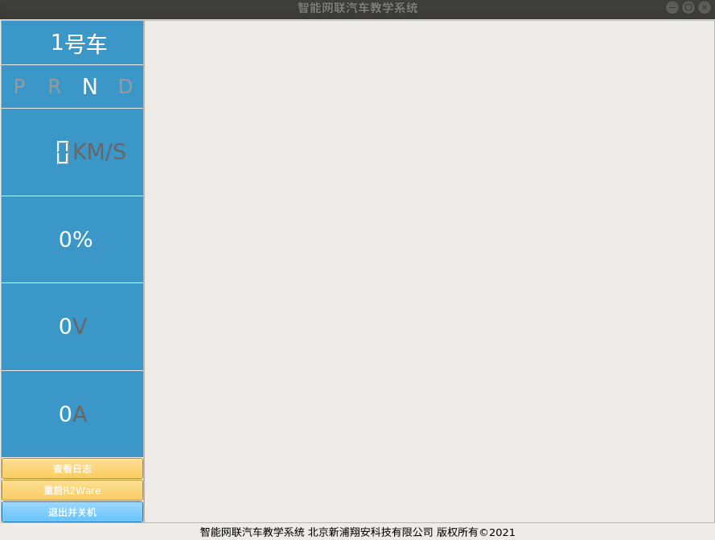

### 概述

```flow
st=>start: 开始
e=>end: 结束
op0=>operation: 用户启动程序
op1=>operation: 验证mac地址
cond=>condition: mac地址已注册？
op3=>operation: 显示mac错误信息
op2=>operation: 初始化并显示车端主界面
op4=>operation: 显示验证通过信息
st->op0->op1->cond
cond(no)->op3->op1
cond(yes)->op4->op2->e
```



初始化并显示车端主界面的主要流程如下：
1. 车辆首页初始化
2. 访问服务端接口，[获取车辆信息](http://192.168.10.106:8080/project/3?p=311)并显示
3. 访问服务端接口，[解绑当前车辆](http://192.168.10.106:8080/project/3?p=312)
5. 获取本机IP地址，并在服务端[注册当前车辆](http://192.168.10.106:8080/project/3?p=316)
6. 开启[车辆节点服务](http://192.168.10.106:8080/project/3?p=297)
7. 访问车辆服务端接口，提起车辆端roscore，访问[car_sys_start](http://192.168.10.106:8080/project/3?p=197)
8. 处理车辆节点数据，通过[车辆服务](http://192.168.10.106:8080/project/3?p=297)，获取并更新车辆状态栏车辆数据
9. 访问上传车辆数据接口，向服务器上传当前车辆运行数据
10. 访问上传车辆传感器数据接口，向服务器上传当前车辆传感器信息
9. 启动rviz界面，展示车辆信息

### 具体逻辑
在车端首页初始化时，会开启一个线程运行`start`函数

``` py
# ui/VehicleUi.py
        start_thread_work(self.start)
```

`start`函数是车端首页的主逻辑循环，其具体程序功能如下：

``` py
# ui/VehicleUi.py
    def start(self):
		... ...
```

1. 访问服务端接口，[获取车辆信息](http://192.168.10.106:8080/project/3?p=311)并显示
	```py
	# 获取车辆信息
        self.vehicle_info = self.get_vehicle_info()
        self.vehicle_current_data['vehicle_id'] = self.vehicle_info['id']
        # 在ui界面显示车辆id
        self.signal_set_label_vehicle_id.emit(self.vehicle_current_data['vehicle_id'])
	```
	获取车辆信息是调用`self.get_vehicle_info`函数
	```py
	# ui/VehicleUi.py
	def get_vehicle_info(self):
        state, result = self.server_communication.communicate({
            'action': 'vehicle_get_vehicle_info_by_mac',
            'info': {
                'mac': get_mac_address()
            }
        })
		... ...
	```
3. 访问服务端接口，[解绑当前车辆](http://192.168.10.106:8080/project/3?p=312)
	``` py
	# 在服务端解绑当前车辆
	# 访问VehicleInfo表，查询id字段值等于在【检查Mac地址是否被许可】返回的id值的记录，将其status值更新为“unbind”
	if not self.is_vehicle_unbind:
		# 车辆未解绑，则解绑
		if not self.unbind_vehicle():
			# 解绑失败
			continue
		# 解绑成功
		self.is_vehicle_unbind = True
	```
	使用`self.unbind_vehicle`函数进行车辆解绑的具体操作。
	```py
	# ui/VehicleUi.py
	def unbind_vehicle(self):
        self.signal_write_log.emit(sim_log('正在解绑车辆'))
        state, result = self.server_communication.communicate({
            'action': 'vehicle_unbind_vehicle',
            'info': {
                'id': self.vehicle_info['id']
            }
        })
		... ...
	```
4. 获取本机IP地址，并在服务端[注册当前车辆](http://192.168.10.106:8080/project/3?p=316)
	```py
	# 获取本机ip地址
	if not self.ip_address:
		# 未获取，则获取
		self.ip_address = self.get_ip_address()
		if not self.ip_address:
			# 获取失败
			continue
	# 在服务端注册当前车辆
	# 在VehicleRegister表中插入新记录，其action_type字段值设置为“register”
	if not self.is_vehicle_register:
		# 车辆未注册，则注册
		state = self.register_vehicle()
		if not state:
			# 注册失败
			continue
		# 注册成功
		self.is_vehicle_register = True
	```
	进行车辆注册的函数为`self.register_vehicle`
	```py
	# ui/VehicleUi.py
	def register_vehicle(self):
        self.signal_write_log.emit(sim_log('正在注册车辆'))
        state, result = self.server_communication.communicate({
            'action': 'vehicle_register_vehicle',
            'info': {
                'vehicle_id': self.vehicle_info['id'],
                'vehicle_ip': get_host_ip(),
                'action_time': datetime_now(),
                'action_type': 'register'
            }
        })
		... ...
	```
5. 最终，进行下列操作
	1. 开启[车辆节点服务](http://192.168.10.106:8080/project/3?p=297)
	2. 访问车辆服务端接口，提起车辆端roscore，访问[car_sys_start](http://192.168.10.106:8080/project/3?p=197)
	3. 处理车辆节点数据，通过[车辆服务](http://192.168.10.106:8080/project/3?p=297)，获取并更新车辆状态栏车辆数据
	4. 启动rviz界面，展示车辆信息
	```py
	# 开始与车辆的ros节点进行通讯
	if not self.is_vehicle_node_service_start:
		# 如果未开启车辆节点服务，则开启
		self.vehicle_node_service.start_vehicle_node.set()
		self.signal_write_log.emit("正在连接智能网联汽车")
		self.is_vehicle_node_service_start = True
		# 通知车端服务提起roscore
		vehicle_communication.send({'action': 'car_sys_start'})
		# 开始处理车辆节点数据
		start_thread_work(self.start_processing_vehicle_node_data)
		# 开始启动rviz初始化服务
		start_thread_work(self.start_rviz_service)
	```
	其中，`self.start_processing_vehicle_node_data`函数如下，其中需要注意的点是，`self.vehicle_node_service.is_ros_core_ok`是通过[车辆数据服务](http://192.168.10.106:8080/project/3?p=297)取到的。
	```py
	# ui/VehicleUi.py
	def start_processing_vehicle_node_data(self):
        start_time = time.time()
        while True:
            time.sleep(0.1)
            if self.vehicle_node_service.is_ros_core_ok is False:
                # 如果ros节点未启动
                self.signal_write_log.emit(sim_log('智能车ros 服务未启动，请等待...'))
                time.sleep(1)
                continue
            if self.is_ros_core_ok is False:
                # 如果ros节点已启动
                self.signal_write_log.emit(sim_log('智能车ros 服务已经启动，已连接！'))
                self.is_ros_core_ok = True
            # 如果ros节点已启动,更新车辆实时运行数据
            self.update_vehicle_current_data()
            # 更新gui
            self.signal_update_ui_vehicle_current_data.emit()
            # 记录车辆实时运行数据
            self.log_vehicle_current_info()
            if time.time() - start_time > 3:
                # 更新传感器状态数据
                self.update_vehicle_sensor_status_data()
                # 写入传感器状态数据
                self.log_vehicle_sensor_current_status()
                start_time = time.time()
	```
	在