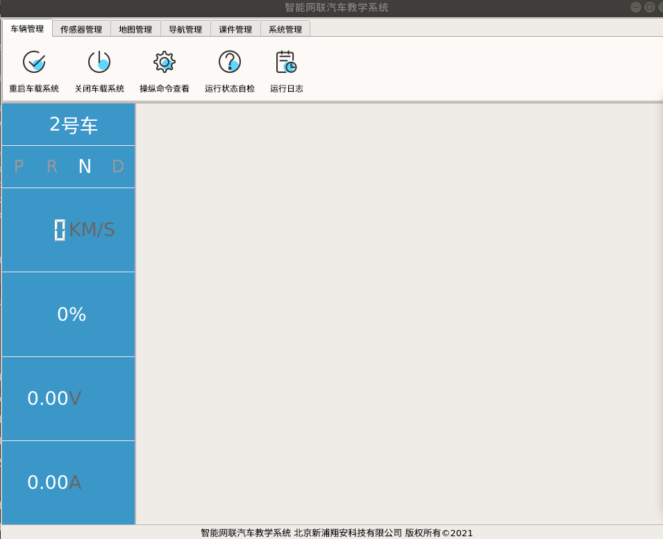
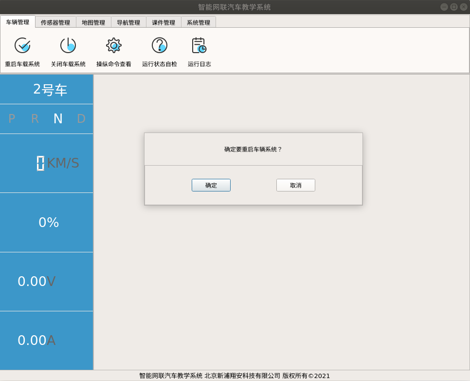
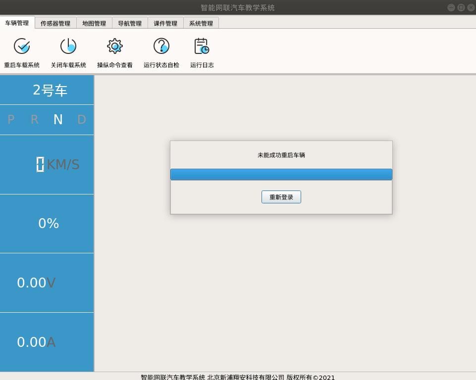
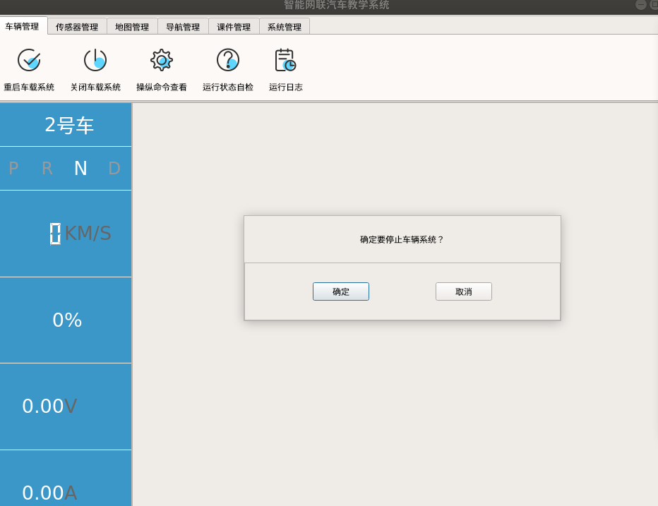
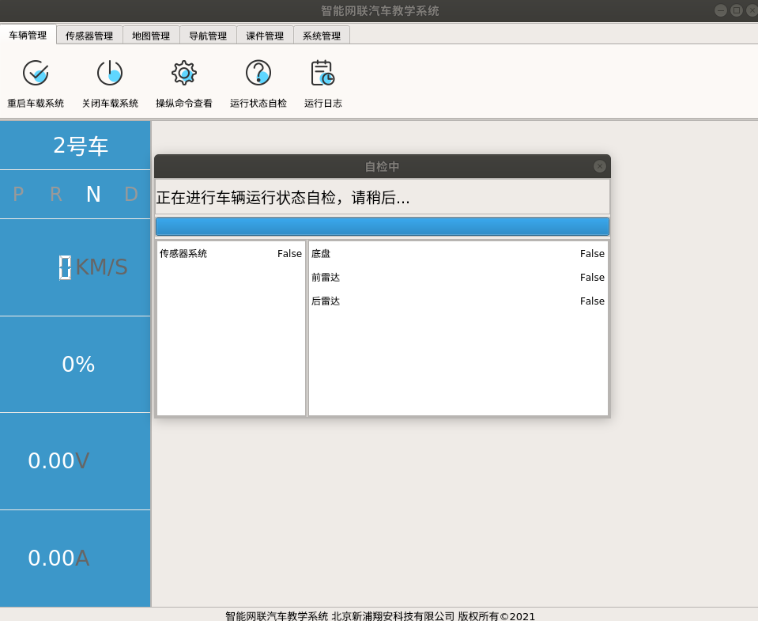
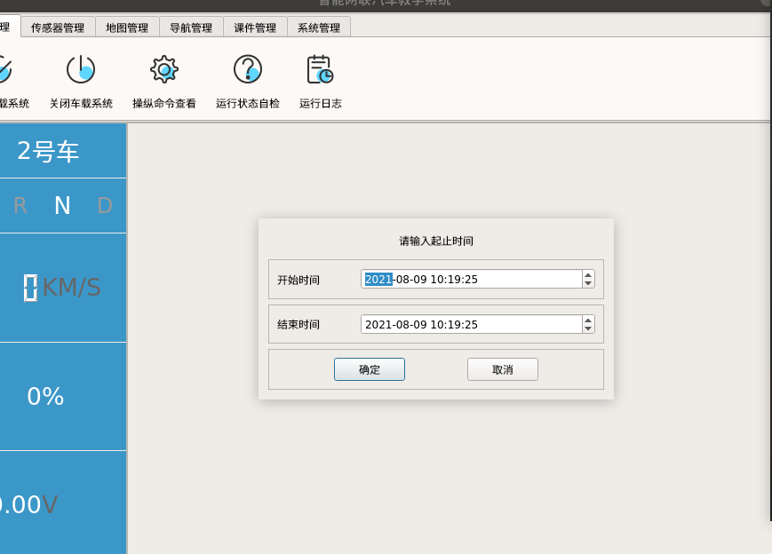
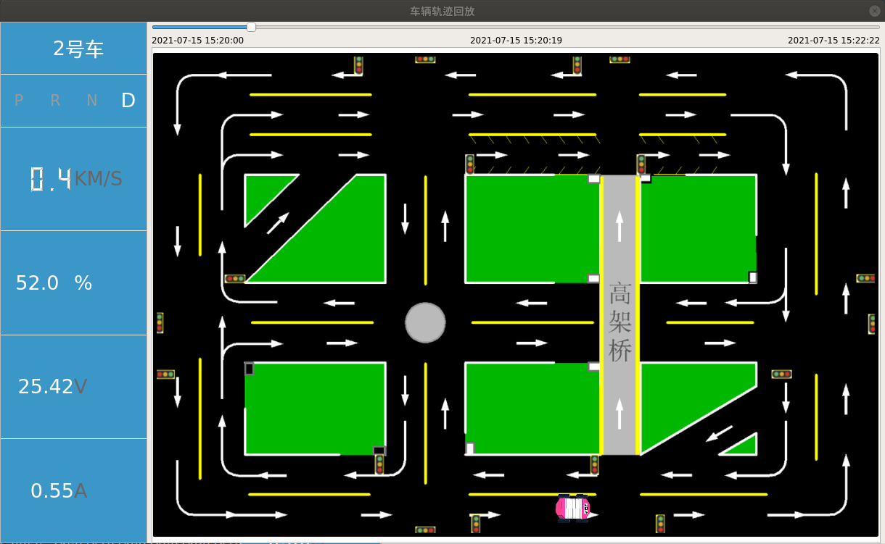

# 车辆管理
车辆管理主界面如下

### 重启车载系统

重启车载系统按钮的点击事件在`ui/student.py`中的`register_all`函数中进行信号连接，其点击事件连接到`self.restart_vehicle_node`函数，`self.restart_vehicle_node`函数又调用了`self.restart_vehicle_dialog.restart_vehicle`函数，而`self.restart_vehicle_dialog`是`RestartVehicleDialog`的一个实例。

``` py
# ui/student.py
# 重启车辆界面
self.restart_vehicle_dialog = RestartVehicleDialog(self)
```

``` py
# ui/student.py
# 重启车端系统按钮
self.ui.button_restart_vehicle_system.clicked.connect(self.restart_vehicle_node)
```

``` py
# ui/student.py
def restart_vehicle_node(self):
	# 重启车端系统
	self.restart_vehicle_dialog.restart_vehicle()
```
重启车辆系统的界面如下：

确定按钮点击信号连接到`self.restart_vehicle_submit`函数上。

``` py
# ui/vehicle_management/restart_vehicle.py
    def register_all(self):
        self.submit.clicked.connect(self.restart_vehicle_submit)
        self.cancel.clicked.connect(self.restart_vehicle_cancel)
```
`self.restart_vehicle_submit`函数会触发`self.restart_process.signal_restart_vehicle`信号。

``` py
# ui/vehicle_management/restart_vehicle.py
    def restart_vehicle_submit(self):
        self.restart_process.signal_restart_vehicle.emit()
        self.hide()
```
`self.restart_process.signal_restart_vehicle`被连接到`self.restart_vehicle`函数，并最终执行。

``` py
# ui/vehicle_management/restart_vehicle.py
    def register_all(self):
        self.submit.clicked.connect(self.close)
        # self.cancel.clicked.connect(self.hide)
        self.signal_restart_vehicle.connect(self.restart_vehicle)
        self.signal_set_text.connect(self.set_text)
        self.signal_progress_i.connect(self.progress_i)
```

``` py
# ui/vehicle_management/restart_vehicle.py
    def restart_vehicle(self):
		... ...
```

在`self.restart_vehicle`函数执行时，会调用车端服务接口与数据库服务端接口，其基本逻辑为：
1. 调用车端服务端接口[car_sys_restart](http://192.168.10.106:8080/project/3?p=197)
   - 若成功则调用数据库服务端接口[student_stop_vehicle_system](http://192.168.10.106:8080/project/3?p=160)再调用[student_start_vehicle_system](http://192.168.10.106:8080/project/3?p=161)
   - 若失败则显示相应的信息

其对应代码如下：

``` py
# ui/vehicle_management/restart_vehicle.py
state, result = vehicle_communication.communicate({
	'action': 'car_sys_restart'
})
if state:
	self.signal_set_text.emit("车载系统已经重启启动！")
	print server_communication.communicate({
		'action': 'student_stop_vehicle_system',
		'info': {
			'vehicle_id': self.master.vehicle_info['id'],
			'terminal_mac': self.master.terminal_mac,
			'user_code': self.master.user_info['user_code'],
			'close_time': datetime_now(),
		}
	})
	server_communication.communicate({
		'action': 'student_start_vehicle_system',
		'info': {
			'vehicle_id': self.master.vehicle_info['id'],
			'terminal_mac': self.master.terminal_mac,
			'user_code': self.master.user_info['user_code'],
			'start_time': datetime_now(),
		}
	})
	sim_log("车载系统已经重启启动！")
else:
	self.signal_set_text.emit("未能成功重启车辆")
	sim_log("未能成功重启车辆")
```



### 关闭车载系统
关闭车载系统按钮点击信号连接到`self.stop_vehicle_node`函数上

``` py
# ui/student.py
        # 关闭车端系统按钮
        self.ui.button_stop_vehicle_system.clicked.connect(self.stop_vehicle_node)
```
`self.stop_vehicle_node`函数调用`self.stop_vehicle_dialog.stop_vehicle()`函数

``` py
# ui/student.py
    def stop_vehicle_node(self):
        # 关闭车端系统
        self.stop_vehicle_dialog.stop_vehicle()
```
其最终调用的函数为：

``` py
# ui/vehicle_management/stop_vehicle.py
    def stop_vehicle(self):
        self.show()
```
关闭车载系统界面如下：


其确定按钮连接到`self.stop_vehicle_submit`函数下。
``` py
# ui/vehicle_management/stop_vehicle.py
    def register_all(self):
        self.submit.clicked.connect(self.stop_vehicle_submit)
        self.cancel.clicked.connect(self.stop_vehicle_cancel)
```
`self.stop_vehicle_submit`触发`self.stop_process.signal_stop_vehicle`信号

``` py
# ui/vehicle_management/stop_vehicle.py
    def stop_vehicle_submit(self):
        self.stop_process.signal_stop_vehicle.emit()
        self.hide()
```
`self.stop_process.signal_stop_vehicle`信号连接到`self.stop_vehicle`函数下。最终执行的函数就是此函数。

``` py
# ui/vehicle_management/stop_vehicle.py
    def register_all(self):
        self.submit.clicked.connect(self.close)
        # self.cancel.clicked.connect(self.hide)
        self.signal_stop_vehicle.connect(self.stop_vehicle)
        self.signal_set_text.connect(self.set_text)
        self.signal_progress_i.connect(self.progress_i)
```
`self.stop_vehicle`函数如下：

``` py
# ui/vehicle_management/stop_vehicle.py
def stop_vehicle(self):
        self.signal_progress_i.emit(0)
        self.show()

        def stop():
            start_thread_work(self.progress)
            state, result = vehicle_communication.communicate({
                'action': 'car_sys_stop'
            })
            if not state:
                self.signal_set_text.emit("成功关闭车辆")
                sim_log("成功关闭车辆")
                server_communication.communicate({
                    'action': 'student_stop_vehicle_system',
                    'info': {
                        'vehicle_id': self.master.vehicle_info['id'],
                        'terminal_mac': self.master.terminal_mac,
                        'user_code': self.master.user_info['user_code'],
                        'close_time': datetime_now(),
                    }
                })
            else:
                self.signal_set_text.emit("未能成功关闭车辆")
                sim_log("未能成功关闭车辆")

        start_thread_work(stop)
```
在`self.stop_vehicle`函数执行时，会调用车端服务接口与数据库服务端接口，其基本逻辑为：
1. 调用车端服务端接口[car_sys_stop](http://192.168.10.106:8080/project/3?p=197)
   - 若成功则调用数据库服务端接口[student_stop_vehicle_system](http://192.168.10.106:8080/project/3?p=160)
   - 若失败则显示相应的信息
   
##### 涉及的服务端接口
- `student_stop_vehicle_system`：关闭车载系统，位于`app/businesslogic/user.py
  发送包：
	``` py
	{
		# 动作名，必须
		'action': 'student_stop_vehicle_system',
		'info': {
		# 车辆ID，必须
			'vehicle_id': self.master.vehicle_info['id'],
		# 本机设备mac地址，必须
			'terminal_mac': self.master.terminal_mac,
		# 用户码，必须
			'user_code': self.master.user_info['user_code'],
		# 时间，必须
			'close_time': datetime_now(),
		}
	}
	```
	返回包：
	``` py
	return True or False,{
		detail:detail
	}
	```

- `student_start_vehicle_system`：开启车载系统，位于`app/businesslogic/user.py
	发送包：
	```py
	{
	# 动作名，必须
		'action': 'student_start_vehicle_system',
		'info': {
		# 车辆ID，必须
			'vehicle_id': self.master.vehicle_info['id'],
			# 本机设备mac地址，必须
			'terminal_mac': self.master.terminal_mac,
			# 用户码，必须
			'user_code': self.master.user_info['user_code'],
			# 时间，必须
			'start_time': datetime_now(),
		}
	}
	```
	返回包：
	``` py
	return True or False,{
		detail:detail
	}
	```

### 运行状态自检
运行状态自检按钮按下信号连接到`self.self_check`函数下。

``` py
# ui/student.py
self.ui.button_self_check.clicked.connect(self.self_check)
```
`self.self_check`函数调用`self.self_check_dialog.check`函数

``` py
# ui/student.py
    def self_check(self):
        self.self_check_dialog.check()
```
`self.self_check_dialog.check`函数如下：
``` py
# ui/vehicle_management/self_check.py
    def check(self):
        self.ui.table_system_status.clear()
        self.ui.table_system_status.setRowCount(0)
        self.ui.table_sensor_status.clear()
        self.ui.table_sensor_status.setRowCount(0)
        self.show()
        start_thread_work(self.__check)
```
此函数前四句用以清空表格控件数据，之后调用了`self.__check`方法。

``` py
# ui/vehicle_management/self_check.py
    def __check(self):
        self.progress_mid = random.randint(20, 80)
        self.__progress2mid()
        self.signal_add_table_system_check_line.emit({'desc': '传感器系统', 'status': False})
        vehicle_sensors = copy.deepcopy(self.master.vehicle_node_service.sensors)
        start_thread_work(self.check_sensors, args=(vehicle_sensors,))
        self.__progress2_100()
```
`self.__check`方法中，核心部分在于开启线程调用`self.check_sensors`方法。需要注意的点是，在`start_thread_work(self.check_sensors, args=(vehicle_sensors,))`一句中，`vehicle_sensors`是通过车辆数据服务取到的车辆传感器实时数据。车辆数据服务

``` py
# ui/vehicle_management/self_check.py
    def check_sensors(self, sensors):
        for sensor in sensors.values():
            self.signal_add_table_sensor_check_line.emit(sensor)
```
其中`signal_add_table_sensor_check_line`信号连接到`self.add_table_sensor_check_line`函数下。

``` py
# ui/vehicle_management/self_check.py
    def register_all(self):
        self.signal_progress_set_value.connect(self.set_progress_bar_value)
        self.signal_add_table_system_check_line.connect(self.add_table_system_check_line)
        self.signal_add_table_sensor_check_line.connect(self.add_table_sensor_check_line)
```

`self.add_table_sensor_check_line`函数内容如下：
``` py
    def add_table_sensor_check_line(self, data):
        row = self.ui.table_sensor_status.rowCount()
        self.ui.table_sensor_status.setRowCount(row + 1)
        self.ui.table_sensor_status.setItem(row, 0, QTableWidgetItem(str(data['desc'])))
        self.ui.table_sensor_status.setItem(row, 1, QTableWidgetItem(str(data['data_status'])))
```
自检完成显示如下：


### 运行日志
运行日志按钮连接到`self.replay_dialog.now_show`函数上。
``` py
# ui/student.py
# 车辆轨迹回溯按钮
        self.ui.button_view_log.clicked.connect(self.replay_dialog.now_show)
```
`self.replay_dialog.now_show`函数如下，`self.signal_alert`信号用于触发更改日志时间弹窗上提示文字的函数。
``` py
# ui/vehicle_management/replay.py
    def now_show(self):
        self.signal_alert.emit("请输入起止时间")
        self.show()
```
此函数触发后界面显示如下：


确定按钮连接到`self.user_commit`函数

``` py
# ui/vehicle_management/replay.py
    def register_all(self):
        self.commit.clicked.connect(self.user_commit)
        self.cancel.clicked.connect(self.user_cancel)
        self.signal_alert.connect(self.alert)
```
`self.user_commit`函数的功能主要为：
1. 检查开始时间与结束时间的选择是否合理
2. 触发回放小车轨迹的信号：`self.signal_replay_vehicle_track`

``` py
    def user_commit(self):
        if self.start_time.dateTime() >= self.end_time.dateTime():
            self.signal_alert.emit("结束时间必须大于开始时间")
            return
        if self.end_time.dateTime().toTime_t() - self.start_time.dateTime().toTime_t() > 3600:
            self.signal_alert.emit("最多只能回放一小时内的轨迹数据")
            return
        self.signal_alert.emit("正在查询...")
        start_time = self.start_time.dateTime().toTime_t()  # toString("yyyy-MM-dd hh:mm:ss")
        end_time = self.end_time.dateTime().toTime_t()  # toString("yyyy-MM-dd hh:mm:ss")
        self.signal_replay_vehicle_track.emit([start_time, end_time])
        self.hide()
```
`self.signal_replay_vehicle_track`信号被连接到`self.sand_box_dialog.replay`函数下，最终调用函数也就是`self.sand_box_dialog.replay`函数。
``` py
# ui/student.py
self.replay_dialog.signal_replay_vehicle_track.connect(self.sand_box_dialog.replay)
```
`self.sand_box_dialog.replay`函数如下，此函数主要有以下功能：
1. 接受用户选择的时间
2. 显示小车沙盘界面
3. 开始小车轨迹回放服务

``` py
# ui/vehicle_management/sandbox_dialog.py
    def replay(self, data):
        self.start_time, self.current_time = data[0], data[0]
        self.stop_time = data[1]
        self.set_replay_time_bar(self.current_time)
        self.show()
        self.sandbox.finish = False
        start_thread_work(self.replay_running_track_service, args=(data,))
        self.signal_button_start.emit()
```
有关沙盘的功能在见[控制端沙盘]()
学生沙盘如图所示：


# 控制端沙盘
控制端的沙盘被分解为一个`graphics_view`的场景组件
### 学生沙盘
学生沙盘由车辆状态栏、沙盘状态栏和车辆沙盘组成，如下图所示。
左侧为车辆状态栏，右侧上方为沙盘状态栏，右侧下方为车辆沙盘。


学生沙盘在学生界面ui类初始化：

``` py
# ui/student.py
# 车辆轨迹回溯沙盒
        self.sand_box_dialog = SandBoxDialog(self.vehicle_info)
```
`SandBoxDialog`类位于`ui/vehicle_management/sandbox_dialog.py`中。
此界面主要用来显示当前车辆的历史运行数据与重现运行轨迹。
初始化此类需要使用一个字典，这个字典里面需要包括目标车辆的`id`。
示例：
``` py
self.vehicle_info = dict()
self.vehicle_info['id'] = 2
SandBoxDialog(self.vehicle_info)
```
##### 车辆状态栏
车辆状态栏使用`signal_set_vehicle_display_status`信号控制，在实际程序中，对车辆状态栏的控制如下：
``` py
# ui/vehicle_management/sandbox.py
self.master.signal_set_vehicle_display_status.emit(vehicle_running_track[self.i])
```
此信号被连接到`self.set_vehicle_display_status`函数下。

``` py
# ui/vehicle_management/sandbox_dialog.py
self.signal_set_vehicle_display_status.connect(self.set_vehicle_display_status)
```

# 沙盘管理
### 显示沙盘动态
### 关闭沙盘动态
### 沙盘实景演示

# 车辆首页
