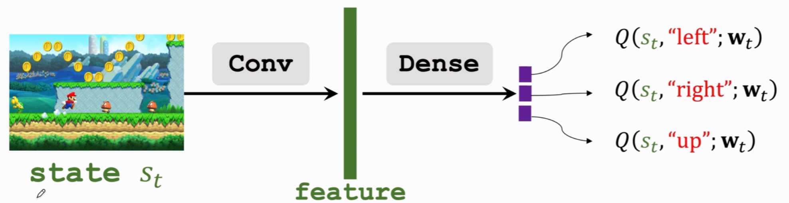
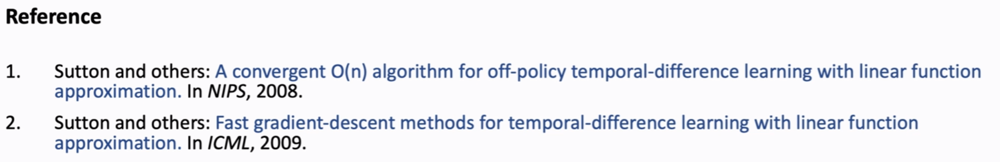
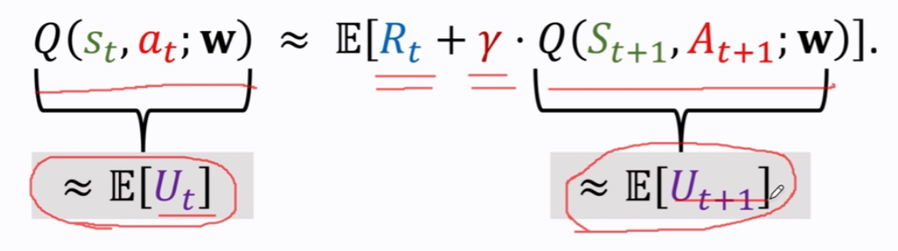
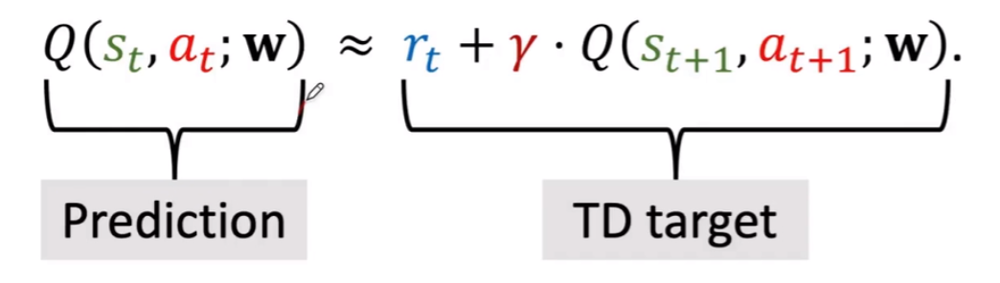

# Approximate the Q Function
**goal**: win the game ($\approx$ maximize the total reward.)
**Question**: If we know $Q^*(s,a)$, what is the best action?
- obviously, the best action is $a^*=\underset{a}{argmax}Q^*(s,a)$ 

**Challenge**: We do not know $Q^*(s,a)$.

- solution: DQN
- Use neural network **Q(s,a;w)** to approximate $Q^*(s,a)$

## DQN
- input shape: size of the screenshot.
- Output shape: dimension of action space

## Temporal Difference (TD) Learning

**Example**
- I want to drive from N to A
- Model $Q(w)$ estimates the time cost, e.g., 1000 minutes

**Question：how to update the model**
1. Gradient descent

- Can i update before finishing the trip?
	- TD target (more reliable)
	- TD error
- Can i get a better $w$ as soon as I arrived DC? 

## TD Learning for DQN
$$T_{N\to{}A}\approx{}T_{N\to{}D}+T_{D\to{}A}$$

In deep reforcement learning:
$$Q(s_t,a_t;w)\approx{}r_t+\gamma\cdot{}Q(s_{t+1},a_{t+1};w)$$

identify:$U_t=R_t+\gamma$
- DQN's output, $Q(s_t,a_t;w)$, is estimate of $\mathbb{E}[U_t]$
- DQN's output, $Q(s_{t+1},a_{t+1};w)$, is estimate of $\mathbb{E}[U_{t+1}]$
- Thus, $Q(s_t,a_t;w)\approx{}\mathbb{E}[R_t + \gamma\cdot{}Q(S_{t+1},A_{t+1};w)]$
- $Q(s_t,a_t;w)\approx{}r_t + \gamma\cdot{}Q(S_{t+1},A_{t+1};w)$

## Train DQN using TD learning
- prediction;$Q(s_t,a_t;w_t)$
- TD target: $y_t=r_t+\gamma\cdot{}Q(s_{t+1},a_{t+1};w_t)=r_t+\gamma\cdot{}\underset{a}{max}Q(s_{t+1,a;w_t})$