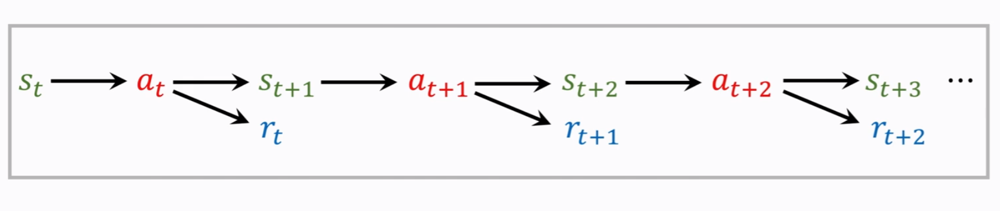

# Terminology
## state and action
- state $s$ (this frame)
- action a $\in$ {left}
- policy $\pi$
	- policy function $\pi:(s,a) \to [0,1]$:
		- $\pi(a|s)=\mathbb{P}(A=a|S=s)$
	- it is the probability of taking action $A=a$ given state $s$, e.g.,
		- $\pi(left|s)=0.2$
		- $\pi(right|s)=0.2$
		- $\pi(up|s)=0.6$
	- upon observing state $S = s$ ,the agent's action A can be random
- reward $R$
	- Collect a coin : $R = +1$
	- Win a game: $R=+10000$
	- Loss a  game:$R=-10000$
	- Nothing happens:$R=0$
- state transision
	- state transision can be random
	- Radomness is from the enviorment
	- $p(s'|s,a) = \mathbb{P}(S'=s'|S=s,A=a)$

## agent environment interaction
](./images/1640243418748.png)
- actions have randomness
	- Given state $s$, the action can be random,e.g.,
		- $\pi(left|s)=0.2$
		- $\pi(right|s)=0.2$
		- $\pi(up|s)=0.6$
- State transitions have ramdomness.
	- Given state $S=s$ and action $A=a$, the environment randomly generates a new state $S'$

## Playing the game  using AI
- observe a frame (state s_1)
- Make action a_1
- observe a new frame (state s_2) and reward r_1
- make action a_2
- ...

(state, action, reward) trajectory
$(s_1,a_1,r_1) ... (s_T,a_T,r_T)$

## Return
Definition: Return (aka cumulative future reward).
- $U_t=R_t+R_{t+1}+...$
	Are $R_t$ and $R_{t+1}$ equally important?

Definition: Discounted return (aka cumlative discounted future reward).
- $\gamma$:discount rate (tuning hyper-parameter)
- $U_t = R_t + \gamma{}R_{t+1}+...+ \gamma^tR_{t}+...$

At time step t, the return U_t is random.
- Two sources of randomness:
	- Action can be random:$\mathbb{P}[A=a|S=s] = \pi(a|s)$
	- New state can be random: $\mathbb{P}[S'=s'|S=s,A=a] = p(s'|s,a)$
- for any $i\geq t$, the reward $R_i$ depends on $S_i$ and $A_i$
- Thus, given $s_t$, the return $U_t$ depends on the random variabels:
	- $A_t,A_{t+1},A_{t+2},\cdots \   and \ S_{t+1},S_{t+2},\cdots .$

## Value Functions
### Action-Value Function $Q(s,a)$
Definition: Discounted return (aka cumulative discounted futrure reward).
- $U_t=R_t+\gamma{}R_{t+1}+\cdots$ 
	只是一个随机变量，在$t$时刻我们不知道其数值

Definition: Action-Value function for policy $\pi$
- $Q_\pi{}(s_t,a_t)=\mathbb{E}[U_t|S_t=s_t,A_t=a_t]$
- return $U_t$ depends on actions $A_t,A_{t+1},\cdots$ and states $S_t,S_{t+1},\cdots$
- Actions are random: $\mathbb{P}[A=a|S=s]=\pi(a|s).$ (policy function)
- States are random: $\mathbb{P}[S'=s'|S=s,A=a]=p(s'|s,a)$ (State transition)

Definition: Optimal action-value function
- $Q^*(s_t,a_t)=\underset{\pi}{max}Q_\pi(s_t,a_t)$

Definition: State-value function
- $V_\pi(s_t)=\mathbb{E}_A[Q_\pi(s_t,A)] = \sum_a\pi(a|s_t)\cdot{}Q_\pi(s_t,a).$ 可以告诉我们当前局势好不好

Understanding the Value Functions
- Action-value function: $Q_\pi(s_t,a_t)=\mathbb{E}[U_t|S_t=s_t,A_t=a_t].$
	- For policy $\pi$, $Q_\pi$ evaluates how good it is for an agent to pick action a while being in state $s$.
- State-value function: $V_\pi(s)=\mathbb{E}_A[Q_\pi(s|A)]$
	- for fixed policy $\pi$, $V_\pi(s)$ evaluates how good the situation is in state $s$.
	- $\mathbb{E}_S[V_\pi(s)]$ evaluates how good the policy $\pi$ is.

## using reforcement learning
方法1
- Suppose we have a good policy $\pi(a|s)$
	- Upon observe the state $s_t$,
	- random sampling: $a_t\sim\pi(\cdot|s_t).$

方法2
- Suppose we know the optimal acton-value function $Q^*(s|a)$.
	- Upon observe the state $s_t$,
	- choose the action that maximizes the value: $a_t=argmax_a{}Q^*(s_t,a)$.

# Summary
## Terminlogies
- Agent
- Env
- State $s$.
- Action $a$.
- Reward $r$.
- Policy $\pi(a|s)$
- State transition $p(s'|s,a)$

## Return and Value
- Return:
	$U_t=R_t+\gamma{}R_{t+1}+\cdots$
- Action-value  function:
	$Q_\pi(s_t,a_t)=\mathbb{E}[U_t|s_t,a_t]$.
- Optimal action-value function
	$Q^*(s_t,a_t)=\underset{\pi}{max}Q_\pi(s_t,a_t)$
- State value function
	$V_\pi(s_t)=\mathbb{E}_A[Q_\pi(s_t,A)]$

## Play game using reinforcement learning 
- Observe state $s_t$, make action $a_t$, environment gives $s_{t+1}$ and reward $r_t$

## We are going to study
