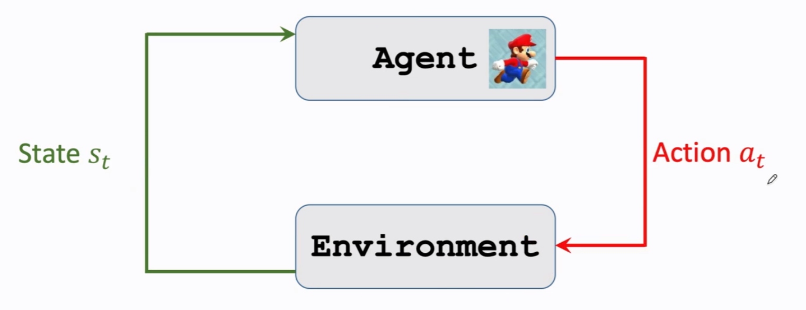

# Terminology
## state and action
- state $s$ (this frame)
- action a $\in$ {left}
- policy $\pi$
	- policy function $\pi:(s,a) \to [0,1]$:
		- $\pi(a|s)=\mathbb{P}(A=a|S=s)$
	- it is the probability of taking action $A=a$ given state $s$, e.g.,
		- $\pi(left|s)=0.2$
		- $\pi(right|s)=0.2$
		- $\pi(up|s)=0.6$
	- upon observing state $S = s$ ,the agent's action A can be random
- reward $R$
	- Collect a coin : $R = +1$
	- Win a game: $R=+10000$
	- Loss a  game:$R=-10000$
	- Nothing happens:$R=0$
- state transision
	- state transision can be random
	- Radomness is from the enviorment
	- $p(s'|s,a) = \mathbb{P}(S'=s'|S=s,A=a)$

## agent environment interaction
](./images/1640243418748.png)
- actions have randomness
	- Given state $s$, the action can be random,e.g.,
		- $\pi(left|s)=0.2$
		- $\pi(right|s)=0.2$
		- $\pi(up|s)=0.6$
- State transitions have ramdomness.
	- Given state $S=s$ and action $A=a$, the environment randomly generates a new state $S'$

## Playing the game  using AI
- observe a frame (state s_1)
- Make action a_1
- observe a new frame (state s_2) and reward r_1
- make action a_2
- ...

(state, action, reward) trajectory
$(s_1,a_1,r_1) ... (s_T,a_T,r_T)$

## Return
Definition: Return (aka cumulative future reward).
- $U_t=R_t+R_{t+1}+...$
	Are $R_t$ and $R_{t+1}$ equally important?
 