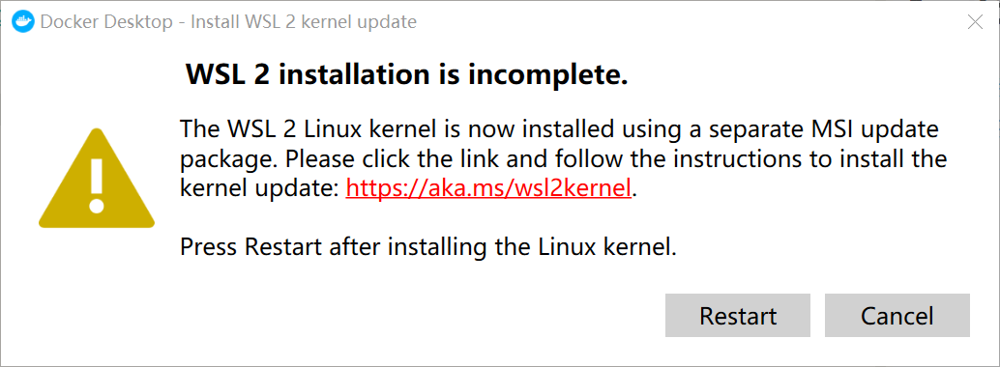
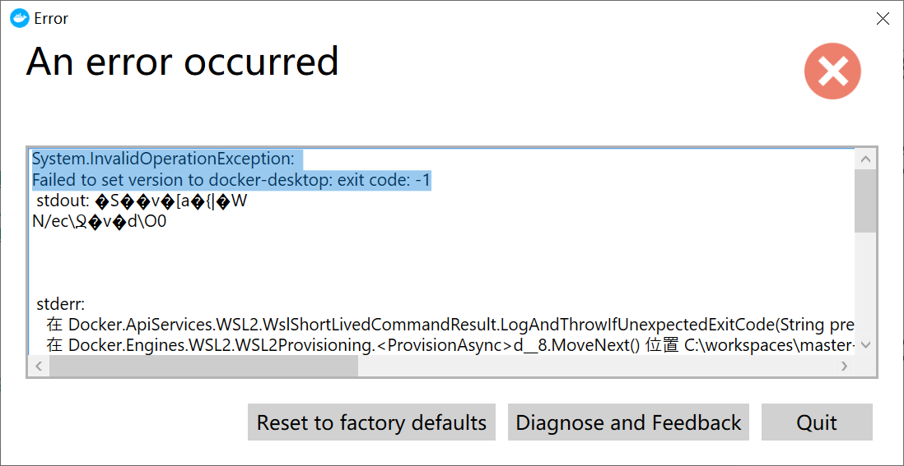

# 安装docker
## 安装过程
[下载链接](https://desktop.docker.com/win/main/amd64/Docker%20Desktop%20Installer.exe?utm_source=docker&amp;utm_medium=webreferral&amp;utm_campaign=dd-smartbutton&amp;utm_location=module)
下载安装即可

## 可能出现的问题
###

则跟随指示完整安装WSL

### 

以管理员方式启动*powershell*
使用`netsh winsock reset`命令重置windows网络设置


# 安装机械臂控制程序编译环境
1. 以管理员权限打开*powershell*，运行
	```bash
	wsl
	```
	进入wsl界面
2. 输入
	```
	docker run -it --name robot_controller ansible/ubuntu14.04-ansible  /bin/bash
	```
	拉取并运行*ubuntu14.04-ansible*镜像并运行并命名为*robot_controller*
3. 在*robot_controller*容器下换源（可选）
	[参考此处](https://www.jianshu.com/p/c0ca2d4ea589)
4. 在*robot_controller*容器下运行命令
	```
	apt-get update
	apt-get install -y libx32gcc-4.8-dev
	apt-get install -y libc6-dev-i386
	apt-get install gcc-multilib g++-multilib
	```