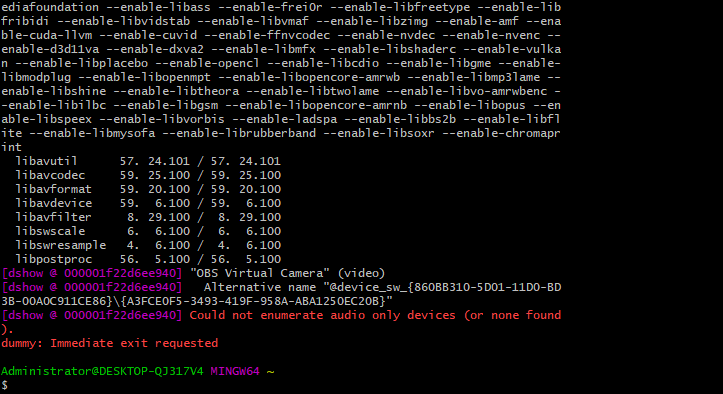

# docker推流服务器

``` bash
docker pull alfg/nginx-rtmp
docker run -it -p 1935:1935 -p 8000:80 --rm alfg/nginx-rtmp
```

# ffmpeg推本地视频到rtmp服务器

``` bash
ffmpeg -re -i <视频文件名> -vcodec copy -f flv <rtmp://服务器地址>
```

**循环推流**
``` bash
 ffmpeg -re  -stream_loop -1  -i ./1.mkv -vcodec copy -acodec aac -ar 44100 -f flv rtmp://127.0.0.1:1935/stream/example
```

# 使用 FFmpeg 获取 DirectShow 设备

``` bash
ffmpeg -list_devices true -f dshow -i dummy
```


# 推送摄像头到 rtsp 服务器

``` bash
ffmpeg -f dshow -i video="Logitech Webcam C930e" -vcodec libx264 -preset:v ultrafast -tune:v zerolatency -rtsp_transport tcp -f rtsp rtsp://127.0.0.1/test

```